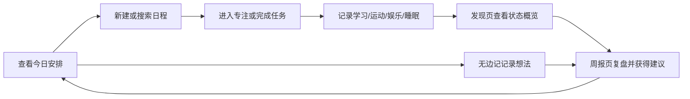
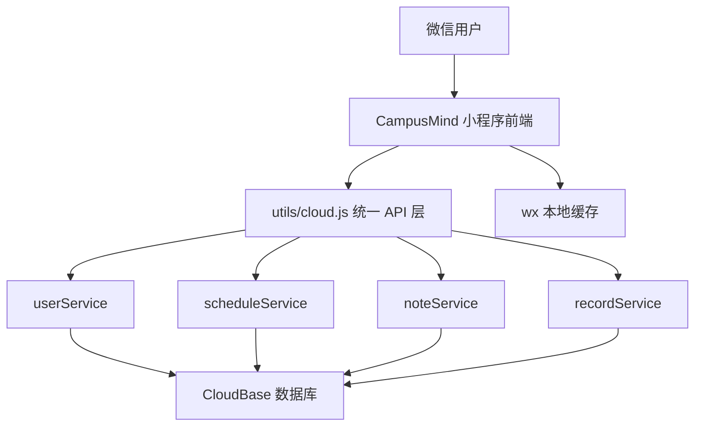

# CampusMind 智伴校园小程序详细技术设计文档

更新日期：2026-06-01  
项目目录：`lifepilot-miniprogram`  
产品名称：`CampusMind`  
工程代号：`CampusMind`

命名说明：当前仓库目录仍为 `lifepilot-miniprogram`，但产品、页面标题、文档名称、云端用户可见名称和后续提交说明均统一使用 `CampusMind`。若后续允许调整工程目录，可将本地目录同步更名为 `campusmind-miniprogram`，但需要同时检查微信开发者工具项目配置中的 `miniprogramRoot`、`cloudfunctionRoot` 和私有配置文件路径。

[TOC]

## 1. 引言

### 1.1 项目背景

大学生的学习生活具有高度碎片化特征。课程、作业、实验、项目、社团、运动、娱乐、睡眠和个人复盘往往分散在多个工具中：课程表用于查看上课安排，备忘录用于记录临时想法，闹钟用于提醒任务，运动或睡眠记录又来自独立应用。多工具并行会带来三个问题：

1. 信息分散，用户需要在多个入口之间来回切换，难以及时判断“今天真正要做什么”。
2. 记录成本较高，学习、娱乐、运动、睡眠等生活状态难以被持续记录。
3. 缺少阶段性反馈，用户即使记录了很多数据，也很难把它们转化为可理解的生活节奏建议。

CampusMind 的设计出发点不是再做一个复杂的综合管理平台，而是围绕学生每天最高频的行为建立一个轻量闭环：查看当天安排、新建日程、记录状态、进入专注、写下无边记、查看周报。它将“日程管理”和“生活复盘”合在一个小程序里，让用户在低成本操作中逐渐看见自己的校园节奏。

### 1.2 项目目标

本项目基于微信小程序开发平台，使用微信云开发作为后端支撑，构建一个面向高校学生的校园生活辅助工具。核心目标如下：

- 让用户打开小程序后能立即看到今天的日程和任务。
- 让用户以较低成本创建课程、会议、作业、考试、个人安排等日程。
- 让日历不仅显示日期，还显示当天发生的日程和无边记内容。
- 将学习、运动、娱乐、睡眠等记录整合到“发现”和“周报”中。
- 提供番茄钟和无边记，支持用户从安排进入行动，从行动进入复盘。
- 通过微信云函数隔离用户数据，为后续 AI 周报、自然语言日程解析、跨端同步等能力预留接口。

### 1.3 当前版本定位

当前版本的核心定位可以概括为：

```text
校园日程管理 + 无边记记录 + 专注行动 + 生活状态周报
```

当前版本已经取消早期“文献总结”方向，避免功能过散，转而围绕学生真实校园生活中的高频任务展开：看今天、排日程、查日历、进专注、记状态、看周报。

## 2. 用户与需求分析

### 2.1 目标用户

主要用户为高校学生，尤其是同时面临课程、作业、考试、项目、社团、运动、娱乐和作息管理压力的学生群体。

用户特征如下：

- 日程来源分散，课程、会议、作业、考试和个人计划经常混在一起。
- 需要快速知道“今天要做什么”，而不是进入复杂的任务管理系统。
- 希望记录学习、娱乐、运动和睡眠情况，但不愿进行繁琐填写。
- 需要阶段性反馈，帮助自己调整学习节奏和生活节奏。
- 对工具的连续使用意愿较脆弱，因此页面必须直接、轻量、可快速完成任务。

### 2.2 用户痛点

| 痛点 | 具体表现 | 设计回应 |
| --- | --- | --- |
| 今日安排不清晰 | 打开多个工具才能知道课程、作业和待办 | 默认首页为今日日程 |
| 新建任务成本高 | 表单太复杂会导致用户放弃记录 | 使用接近系统日历的表单结构 |
| 月度规划不可见 | 只看列表难以感知一段时间的安排密度 | 提供完整月历视图 |
| 临时想法难保存 | 灵感、日记、课堂记录容易散落 | 设计无边记入口 |
| 记录无法复盘 | 学习和生活数据记录后没有反馈 | 发现页和周报页进行聚合展示 |
| 行动与计划脱节 | 有日程但缺少开始执行的入口 | 加入番茄钟选择和计时页面 |

### 2.3 核心使用场景

| 场景 | 用户目标 | 对应功能 |
| --- | --- | --- |
| 早上打开小程序 | 快速查看当天课程、会议和任务 | 今日日程 |
| 收到新任务 | 低成本创建日程并设置时间、提醒、地点 | 新建日程 |
| 复盘某一天 | 查看当天安排、笔记和灵感内容 | 日历日期浮层 |
| 想开始学习 | 选择任务或专注类型后进入计时 | 番茄钟 |
| 睡前记录状态 | 记录学习、娱乐、运动、睡眠和心情 | 生活记录 |
| 周末复盘 | 查看本周生活数据、图表和建议 | 数据化周报 |
| 想记临时想法 | 快速进入自由文本记录 | 无边记 |

## 3. 设计目标

1. 降低入口复杂度：底部导航只保留 4 个一级入口，避免功能堆叠。
2. 强化“今天优先”：首页直接呈现今日日历和当日安排，满足最高频需求。
3. 保持轻量记录：生活数据采用滑块、简短输入和快速保存，降低填写负担。
4. 支持直接操作：通过点击、滑动、拖拽等直接操纵方式减少层级跳转。
5. 形成数据闭环：日程和记录最终汇总到发现页、详情页和周报页。
6. 保留扩展空间：自然语言解析、AI 周报建议、课程导入等作为后续增强方向。
7. 保护个人数据：用户数据按 openid 隔离，AI 读取个人内容必须由用户授权。

## 4. 信息架构

### 4.1 一级导航结构

当前小程序采用 4 个一级导航入口：

```text
今日日程  |  日历视图  |  发现  |  我的
```

底部导航使用自定义 `tabBar`，仅显示图标，不显示文字。这样可以让页面视觉更轻，同时把文本空间留给页面内容本身。当前 `app.json` 中配置的页面顺序如下：

```text
pages/login/login
pages/home/home
pages/calendar/calendar
pages/discover/discover
pages/mine/mine
pages/search/search
pages/scheduleAdd/scheduleAdd
pages/schedule/schedule
pages/record/record
pages/report/report
pages/sport/sport
pages/entertainment/entertainment
pages/sleep/sleep
pages/pomodoroSelect/pomodoroSelect
pages/pomodoroTimer/pomodoroTimer
pages/boundlessNote/boundlessNote
```

### 4.2 页面结构

```text
lifepilot-miniprogram/
├─ miniprogram/
│  ├─ pages/
│  │  ├─ login/            # 登录与用户进入
│  │  ├─ home/             # 今日日程，默认首页
│  │  ├─ calendar/         # 月历视图、日期浮层、无边记管理
│  │  ├─ discover/         # 学习、运动、娱乐、睡眠概览
│  │  ├─ mine/             # 个人资料、目标、隐私授权
│  │  ├─ search/           # 日程搜索
│  │  ├─ scheduleAdd/      # 新建日程
│  │  ├─ schedule/         # 课程表、日程导入和解析预留
│  │  ├─ record/           # 生活状态记录
│  │  ├─ report/           # 数据化周报
│  │  ├─ sport/            # 运动详情
│  │  ├─ entertainment/    # 娱乐详情
│  │  ├─ sleep/            # 睡眠详情
│  │  ├─ pomodoroSelect/   # 专注任务选择
│  │  ├─ pomodoroTimer/    # 番茄钟计时
│  │  └─ boundlessNote/    # 无边记编辑
│  ├─ custom-tab-bar/      # 自定义底部导航
│  ├─ utils/
│  │  ├─ cloud.js          # 前端统一云函数调用层
│  │  ├─ storage.js        # 本地缓存与离线降级
│  │  ├─ analytics.js      # 本地概览和周报计算
│  │  └─ date.js           # 日期工具
│  └─ assets/              # 图标与图片资源
└─ cloudfunctions/
   ├─ userService/         # 用户登录、初始化、资料更新
   ├─ scheduleService/     # 日程创建、查询、搜索、解析
   ├─ noteService/         # 无边记创建、查询、删除
   └─ recordService/       # 生活记录、番茄钟、概览、周报
```

### 4.3 功能闭环



## 5. 核心功能设计

### 5.1 登录与初始化

登录页是用户进入系统的起点。当前版本通过微信云开发获取用户 openid，并在云端创建或更新用户基础资料。

功能内容：

- 进入小程序后首先展示登录页。
- 用户授权或点击进入后调用 `userService.login`。
- 若用户首次进入，则初始化用户资料、默认目标和隐私授权字段。
- 新用户首次登录后进入基本信息录入流程，微信昵称和头像可来自微信授权，其余字段由用户主动填写。
- 基本信息录入字段包括学校、专业、年级、学习目标、运动目标、睡眠目标和娱乐时长限制。
- 用户完成基本信息录入后，系统将 `profileCompleted` 标记为 `true`，后续再次进入不再重复弹出初始化表单。
- 登录成功后进入今日日程页。
- 用户可在“我的”页面退出当前账号，退出后清理本地登录态并返回登录页。

设计理由：

- 将用户身份与微信 openid 绑定，减少传统账号注册成本。
- 以云端用户记录作为后续日程、记录、周报和 AI 权限的统一归属。
- 首次使用不要求填写大量资料，避免进入门槛过高。
- 当前版本除微信昵称和头像外，学校、专业、年级和目标数据仍存在硬编码或默认值，后续需要改为首次登录表单和“我的”页面共同维护。

技术实现补充：

- 登录成功后读取 `userService.getProfile` 返回的 `profileCompleted`。
- 若 `profileCompleted` 为 `false`，跳转到基本信息录入页或在登录页展示资料录入表单。
- 新增或复用 `userService.updateProfile` 保存用户填写内容。
- 本地缓存只保存必要登录状态，不把用户资料作为唯一可信来源。
- 退出登录时清理本地 `userSettings`、登录态缓存和页面全局用户状态，云端用户数据不删除。

### 5.2 今日日程

今日日程是默认首页，负责回答用户最核心的问题：“今天有什么安排？”

页面内容：

- 顶部显示当前月份。
- 顶部右侧提供搜索和新增入口。
- 中部为紧凑日历，支持选择日期。
- 日期下方以小圆点标记当天存在日程。
- 选中某一天后，下方直接展示当天日程列表。
- 日程项支持左滑删除。
- 页面提供无边记浮动入口，便于随手记录。

交互规则：

| 状态 | 视觉规则 |
| --- | --- |
| 普通日期 | 使用基础文字颜色 |
| 选中日期 | 使用强调色背景 |
| 今天 | 使用红色强调 |
| 有日程日期 | 日期下方显示圆点 |
| 无日程日期 | 下方展示空状态 |

设计理由：

- 将“日历”和“当日列表”合并在一个页面，减少来回跳转。
- 首页不堆叠数据概览卡片，把空间留给真正需要执行的安排。
- 搜索和新增放在顶部，贴近日程管理的最高频行为。
- 无边记入口悬浮在底部导航上方，既明显又不干扰日程列表。

技术实现：

- 页面文件：`miniprogram/pages/home/home.*`
- 本地缓存：从 `storage.KEYS.schedules` 读取离线日程。
- 云端查询：调用 `api.schedule.listByDate(date)` 和 `api.schedule.listByMonth(year, month)`。
- 降级策略：云函数调用失败时保留本地缓存结果，不阻塞页面使用。
- 日历生成：通过年份、月份、首日星期和当月天数动态构建日期网格。

### 5.3 新建日程

新建日程页用于录入课程、会议、作业、考试、个人任务等安排。

主要字段：

- 标题。
- 地点或视频会议链接。
- 全天开关。
- 开始日期和时间。
- 结束日期和时间。
- 重复规则。
- 重复结束时间。
- 提醒时间。
- URL。
- 备注。
- 长文本输入。
- 语音输入入口。

交互设计：

- 顶部采用“取消 / 新建日程 / 添加”的结构。
- 时间选择使用微信原生 picker，降低学习成本。
- 重复规则支持从不、每天、每周、每月等扩展方向。
- 底部语音按钮作为后续自然语言和语音解析入口。
- 长文本输入用于粘贴会议说明、课堂要求或任务细节。

设计理由：

- 新建日程参考系统日历，用户迁移成本低。
- 字段完整但排列清晰，适合课程、会议和个人计划等多类型事件。
- 语音和自然语言解析暂不强依赖，避免当前版本因外部能力不稳定影响核心流程。

技术实现：

- 页面文件：`miniprogram/pages/scheduleAdd/scheduleAdd.*`
- 云端创建：`api.schedule.create(data)`
- 服务端校验：标题必填；开始和结束日期必须为 `YYYY-MM-DD`；非全天事件结束时间不能早于开始时间。
- 去重机制：若传入 `clientId` 且云端已有同一用户的同一 `clientId`，则更新旧记录而不是重复新增。

### 5.4 日历视图

日历视图用于查看更完整的月度安排，并把日程、无边记和灵感记录组织在同一日期下。

页面内容：

- 顶部显示当前月份。
- 左右按钮切换月份。
- 月历网格显示日期和农历标签。
- 日期格中展示当天日程短标题。
- 点击日期后打开底部浮层。

日期浮层设计：

- 默认高度约为屏幕的四分之三。
- 顶部设置拖拽条。
- 支持上下拖动切换浮层高度。
- 支持在“详细日程 / 无边记 / 灵感记录”等内容之间切换。
- 浮层内部内容可滚动。
- 日程项支持左滑删除。
- 无边记支持编辑和删除。

设计理由：

- 月视图适合观察安排密度，帮助用户感知忙碌周期。
- 底部浮层避免点击日期后跳转到新页面，保持上下文连续。
- 将日程和无边记放在同一日期下，形成“这一天发生了什么”的完整记录。

技术实现：

- 页面文件：`miniprogram/pages/calendar/calendar.*`
- 本地无边记：通过 `storage.listBoundlessNotesByDate(date)` 读取。
- 云端日程：调用 `api.schedule.listByDate` 与 `api.schedule.listByMonth`。
- 云端无边记：调用 `api.note.listByDate(date)`。
- 删除策略：日程云端软删除，本地记录同步移除；无边记支持云端删除和本地删除。

### 5.5 搜索

搜索页用于按关键词查找日程和无边记。搜索结果的标签只保留两类：`日程` 和 `无边记`。

当前实现：

- 支持输入关键词。
- 支持清空输入。
- 支持确认搜索。
- 搜索结果展示标题、日期、时间、地点、摘要和结果标签。
- 已接入 `scheduleService.search` 云函数。
- 同一个日程在今日视图和日历视图中必须使用同一个日程索引，不允许因为页面来源不同而返回两条搜索结果。

设计理由：

- 搜索入口放在今日页顶部，贴近日常查找场景。
- 搜索结果只展示决策所需信息，避免信息过载。
- 标签只区分“日程”和“无边记”，避免出现“今日日程”“日历日程”“课程”“任务”等过细标签造成理解负担。

技术实现补充：

- 日程数据以 `scheduleId` 或云端 `_id` 作为唯一索引，今日页和日历页都引用同一条日程记录。
- 本地缓存中若存在来自不同页面的同一日程，应通过 `clientId`、`cloudId` 或 `_id` 合并。
- 搜索结果聚合时先按 `type + id` 去重，再按时间排序。
- 搜索接口建议扩展为统一搜索服务，返回结构为 `{ id, type, label, title, date, timeText, summary }`。
- `type` 仅允许 `schedule` 和 `note`，对应展示标签为 `日程` 和 `无边记`。

### 5.6 无边记

无边记用于承载自由记录、灵感、日记、课堂碎片和临时想法。

功能内容：

- 今日页提供快速入口。
- 日历页可按日期查看和编辑无边记。
- 独立无边记页面支持编辑内容。
- 支持按日期保存。
- 支持从旧日记数据迁移合并。

设计理由：

- 学生的很多信息并不适合被结构化成日程，例如课堂灵感、情绪记录、项目想法和临时备忘。
- 无边记降低记录门槛，不要求用户先选择类型。
- 与日期绑定后，它可以参与后续周报和 AI 分析。

技术实现：

- 页面文件：`miniprogram/pages/boundlessNote/boundlessNote.*`
- 本地存储键：`lifepilot_boundless_notes`
- 云端服务：`noteService`
- 数据字段包括 `date`、`type`、`content`、`assets`、`tags`、`visibleToAI` 等。

### 5.7 发现页

发现页用于承载生活数据和周报入口。当前采用四象限结构，将学习、运动、娱乐、睡眠组织在同一屏中。

四象限功能：

| 区域 | 功能 | 作用 |
| --- | --- | --- |
| 学习 | 查看学习时长和建议 | 帮助用户感知专注投入 |
| 运动 | 查看运动次数和目标达成 | 鼓励维持身体活动 |
| 娱乐 | 查看娱乐时长和节奏 | 帮助用户控制娱乐边界 |
| 睡眠 | 查看睡眠时长和评分 | 帮助用户调整作息 |

页面还提供：

- 番茄钟入口。
- 无边记入口。
- 周报或综合状态的引导入口。

设计理由：

- 生活数据不再分散到底部导航，减少一级入口数量。
- 四象限结构有助于形成空间记忆。
- 各模块使用不同颜色和简短建议，便于快速扫描。

技术实现：

- 页面文件：`miniprogram/pages/discover/discover.*`
- 本地概览：`utils/analytics.js` 中的 `buildLocalOverview`。
- 云端概览：`api.record.getOverview()`。
- 降级策略：先展示本地计算结果，云端返回后再覆盖。

### 5.8 生活记录

生活记录页用于快速录入每日状态。

当前记录项：

- 学习分钟数。
- 娱乐分钟数。
- 运动分钟数。
- 睡眠小时数。
- 今日心情。
- 备注。

交互设计：

- 数值类数据使用滑块或轻量输入。
- 心情和备注使用文本输入。
- 保存后写入云端，同时可保留本地缓存。
- 最近记录可作为反馈，帮助用户确认数据已经保存。

设计理由：

- 大学生很难长期坚持复杂记录，因此记录项必须少而明确。
- 学习、娱乐、运动、睡眠是与校园生活节奏最相关的基础指标。
- 滑块比纯数字输入更适合估算型数据。

### 5.9 番茄钟

番茄钟用于让用户从“计划”进入“行动”。

功能内容：

- 选择专注任务或专注类型。
- 进入计时页面。
- 完成后保存专注会话。
- 专注时长同步到生活记录和周报统计。
- 从番茄钟选择页进入计时页时，计时页必须正确接收任务类型、任务标题和时长参数，避免出现空白页面。
- 若参数缺失或任务数据不存在，计时页展示错误状态和返回按钮，而不是渲染空白界面。

设计理由：

- 仅有日程管理并不能保证用户执行任务，番茄钟提供行动入口。
- 将专注记录纳入周报后，用户可以看到安排与实际投入之间的关系。
- 当前版本存在“选择番茄钟选项后进入页面为空白”的问题，需要把它作为高优先级缺陷修复。

技术实现：

- 页面文件：`miniprogram/pages/pomodoroSelect/pomodoroSelect.*`、`miniprogram/pages/pomodoroTimer/pomodoroTimer.*`
- 云端服务：`recordService.createPomodoro`
- 数据集合：`pomodoroSessions`
- 支持字段包括 `scheduleId`、`category`、`durationMinutes`、`startedAt`、`endedAt`、`completed`、`exitReason`。
- `pomodoroSelect` 跳转时应通过 query 参数或本地临时状态传递 `category`、`title`、`durationMinutes`。
- `pomodoroTimer.onLoad(options)` 必须校验参数，缺失时设置 `errorVisible` 并展示可点击返回入口。

### 5.10 数据化周报

周报页将一周内的日程、生活记录和专注数据转化为可读图表和建议。

当前模块：

- 顶部数据卡片：学习总时长、娱乐总时长、运动总时长、平均睡眠。
- 多维能力或状态评分。
- 学习趋势或柱状图。
- 睡眠趋势。
- 生活占比。
- AI 周报建议预留。
- 日记或无边记参与分析的授权提示。

设计重点：

- 不把 1 到 100 分作为唯一反馈，而是通过多个可解释指标展示状态。
- 图表服务于复盘，不追求复杂数据分析。
- AI 分析默认不读取主观内容，必须经过用户授权。

技术实现：

- 页面文件：`miniprogram/pages/report/report.*`
- 云端服务：`recordService.getWeeklyReport`
- 本地计算：`analytics.buildLocalOverview`
- 云端报告集合：`reports`

### 5.11 我的

“我的”页面负责个人资料、目标设置、功能管理和隐私授权。

主要内容：

- 用户昵称、学校、专业和年级。
- 学习目标、运动目标、睡眠目标、娱乐限制。
- 功能管理入口。
- 隐私与 AI 授权开关。
- 周报历史或记录相关入口。
- 编辑个人信息入口。
- 保存个人信息按钮。
- 退出登录按钮。

设计理由：

- 低频设置集中放在“我的”，避免干扰首页高频任务。
- 目标设置与周报计算相关，放在个人页符合用户心理模型。
- AI 权限与个人数据放在同一页面，便于用户理解隐私边界。
- 用户必须能够修改首次登录时填写的信息，否则目标、专业、年级等内容会长期停留在默认值或旧值。

技术实现补充：

- “我的”页面加载时调用 `api.user.getProfile()`，不再依赖硬编码用户资料。
- 用户修改资料后点击保存，调用 `api.user.updateProfile(formData)`。
- 保存成功后刷新全局用户状态和本地必要缓存。
- 保存失败时保留表单内容并展示错误提示。
- 退出登录按钮需要二次确认，确认后清理本地登录态并 `reLaunch` 到登录页。

## 6. 视觉与交互规范

### 6.1 整体风格

CampusMind 采用清爽的校园工具风格。页面以白色和浅灰背景为主，红色用于关键状态、选中日期和主要行动，蓝色、绿色、紫色、橙色等用于区分生活数据类型。

视觉原则：

- 页面保持轻量，不使用过多装饰性元素。
- 关键操作使用明确的颜色和位置。
- 卡片只用于承载独立信息块，避免层层嵌套。
- 图表和分类数据使用多色区分，避免单一色系造成识别困难。
- 文案尽量短，避免在移动端产生换行挤压。

### 6.2 底部导航

底部导航采用自定义 `tabBar`：

- 4 个图标入口。
- 不显示文字。
- 选中态为红色。
- 未选中态为灰色。
- 图标保持较大尺寸，便于点击。

设计理由：

- 4 个入口降低认知负担。
- 图标化导航让页面更轻，但图标语义必须清晰。
- 选中态颜色与日历中的今日状态保持一致。

### 6.3 直接操纵

当前项目使用了多种直接操纵方式：

- 今日页月历上下滑动切换月份。
- 今日页和日历页日程项左滑删除。
- 日历页点击日期打开浮层。
- 日历浮层上下拖动改变高度。
- 日历浮层内部左右切换内容。
- 生活记录通过滑块调整数值。

这些交互符合人机交互课程中“直接操纵”的思想：用户通过点击、滑动、拖拽直接作用于界面对象，减少传统表单和多级菜单带来的操作负担。

### 6.4 页面退出与返回规范

当前版本中搜索、番茄钟、无边记、详情页等非一级页面存在退出路径不明确的问题。后续所有非 tabBar 页面必须提供明确的退出或返回方式。

规范如下：

- 所有由 `wx.navigateTo` 打开的二级页面，顶部左侧提供返回按钮。
- 搜索页顶部提供返回或取消入口，用户可回到来源页。
- 番茄钟选择页提供返回按钮。
- 番茄钟计时页提供退出专注按钮，点击后弹出确认框，避免误触中断计时。
- 无边记编辑页提供保存并返回、直接返回两种路径；若有未保存内容，返回前提示用户。
- 保存、删除、退出等关键操作必须提供 toast、modal 或页面状态反馈。
- 对于自定义导航栏页面，需要自行适配胶囊按钮安全区，避免按钮被微信右上角胶囊遮挡。

## 7. 技术架构

### 7.1 总体架构



前端负责：

- 页面渲染、交互、状态展示和本地乐观更新。
- 调用 `miniprogram/utils/cloud.js` 中的统一 `api`。
- 处理 loading、empty、error、toast 和本地缓存降级。
- 根据用户操作进行页面跳转和数据刷新。

云函数负责：

- 通过 `cloud.getWXContext()` 获取 `OPENID / APPID / UNIONID`。
- 按 openid 隔离用户数据。
- 参数校验、数据写入、软删除、统计聚合。
- 返回统一数据结构。
- 后续承载第三方接口、密钥、token、AI 分析等敏感逻辑。

本地缓存负责：

- 在云端不可用时提供基本可用体验。
- 保存临时日程、生活记录和无边记。
- 支持页面先展示本地结果，再用云端结果覆盖。

### 7.2 前端统一调用层

前端只允许通过 `api` 调用云函数：

```js
const { api } = require("../../utils/cloud");
```

统一调用层的价值：

- 页面不直接拼接云函数调用细节。
- 统一处理返回格式和错误抛出。
- 便于后续替换后端服务或增加日志监控。
- 保证所有页面调用方式一致。

### 7.3 云函数服务划分

当前已合并为 4 个服务型云函数：

| 服务 | action | 用途 |
| --- | --- | --- |
| `userService` | `login` | 登录并同步基础用户信息 |
| `userService` | `init` | 初始化集合、schemaVersion 和当前用户 |
| `userService` | `updateProfile` | 更新目标、偏好和隐私授权 |
| `userService` | `getProfile` | 获取用户资料和目标 |
| `userService` | `logout` | 清理前端登录态的语义接口，云端通常不删除用户 |
| `scheduleService` | `create` | 新建或去重写入日程 |
| `scheduleService` | `update` | 修改状态、标题、地点、备注、专注时长等 |
| `scheduleService` | `delete` | 软删除日程 |
| `scheduleService` | `listByDate` | 查询某日课程和日程 |
| `scheduleService` | `listByMonth` | 查询月视图日程摘要 |
| `scheduleService` | `search` | 搜索课程和日程 |
| `scheduleService` | `parse` | 解析自然语言日程文本 |
| `noteService` | `create` | 新建或更新无边记 |
| `noteService` | `delete` | 删除无边记 |
| `noteService` | `listByDate` | 查询某日所有无边记 |
| `recordService` | `createRecord` | 新建或更新日记录 |
| `recordService` | `createPomodoro` | 保存番茄钟并同步日记录 |
| `recordService` | `getOverview` | 获取发现页概览 |
| `recordService` | `getWeeklyReport` | 生成周报 |

### 7.4 统一返回格式

成功：

```json
{
  "code": 0,
  "message": "success",
  "data": {}
}
```

失败：

```json
{
  "code": 400,
  "message": "valid date is required",
  "data": null
}
```

错误码约定：

| code | 含义 |
| --- | --- |
| `400` | 参数错误 |
| `401` | 未登录或 openid 不存在 |
| `403` | 无权限访问该数据 |
| `404` | action 或资源不存在 |
| `500` | 服务端异常 |

## 8. 数据模型设计

### 8.1 users

用户集合用于存储基础资料、目标和授权偏好。

主要字段：

- `openid`：微信用户唯一标识。
- `userId`：当前版本与 openid 一致。
- `appid`、`unionid`：微信上下文信息。
- `nickName`、`avatarUrl`：用户基础信息。
- `school`、`major`、`grade`：校园身份信息。
- `studyGoal`、`sportGoal`、`sleepGoal`、`entertainmentLimit`：个人目标。
- `allowDiaryAI`、`allowNoteAI`、`allowRecordAI`、`allowReportAI`：AI 分析授权。
- `theme`：主题配置。
- `profileCompleted`：是否已完成首次基本信息录入。
- `lastLoginAt`：最近登录时间。
- `createdAt`、`updatedAt`：创建和更新时间。

### 8.2 schedules

日程集合用于存储课程、任务、会议、考试和个人安排。

主要字段：

- `openid`、`userId`：数据归属。
- `clientId`：前端生成的客户端 ID，用于去重。
- `title`、`type`、`status`、`priority`：基础信息。
- `dateKey`、`year`、`month`、`day`：日期索引。
- `startDateKey`、`endDateKey`、`startTime`、`endTime`：时间信息。
- `startAt`、`endAt`：服务端日期对象。
- `isAllDay`、`allDay`：全天事件标识。
- `repeatRule`：重复规则。
- `reminder`：提醒设置。
- `location`、`url`、`note`：地点、链接和备注。
- `source`、`color`：来源和颜色。
- `focusRequired`、`focusMinutes`：专注相关字段。
- `isCountdown`：倒数日预留。
- `isDeleted`：软删除标识。
- `searchIndexId`：搜索去重索引，优先使用云端 `_id`，本地离线数据使用稳定 `clientId`。
- `createdAt`、`updatedAt`：创建和更新时间。

### 8.3 notes

无边记集合用于存储自由记录。

主要字段：

- `openid`、`userId`、`clientId`。
- `date`：所属日期。
- `type`：记录类型，当前以 `boundless` 为主。
- `content`：正文内容。
- `assets`：图片或附件预留。
- `tags`：标签预留。
- `visibleToAI`：是否允许参与 AI 分析。
- `createdAt`、`updatedAt`。

### 8.4 records

生活记录集合用于存储每日状态。

主要字段：

- `openid`、`userId`。
- `date`。
- `studyMinutes`。
- `entertainmentMinutes`。
- `exerciseMinutes`、`sportMinutes`。
- `sleepHours`。
- `mood`。
- `note`。
- `createdAt`、`updatedAt`。

### 8.5 pomodoroSessions

番茄钟集合用于存储专注会话。

主要字段：

- `openid`、`userId`。
- `scheduleId`。
- `category`。
- `durationMinutes`。
- `startedAt`、`endedAt`。
- `completed`。
- `exitReason`。
- `createdAt`。

### 8.6 reports

周报集合用于缓存或保存周期性复盘结果。

主要字段：

- `openid`、`userId`。
- `weekStart`、`weekEnd`。
- `studyTotal`。
- `entertainmentTotal`。
- `sportTotal`。
- `avgSleep`。
- `scores`。
- `aiSummary`。
- `suggestions`。
- `createdAt`。

## 9. 权限与隐私设计

### 9.1 数据隔离

所有云函数都通过 `cloud.getWXContext()` 获取当前用户 openid，读写数据时必须带上 openid 条件。这样可以保证用户只能访问自己的日程、记录、无边记和周报。

### 9.2 软删除

日程删除采用软删除方式，将 `isDeleted` 设置为 `true`，而不是立即物理删除。这样可以为后续误删恢复、同步冲突处理和审计提供空间。

### 9.3 AI 授权

与 AI 分析相关的数据默认应遵循最小授权原则：

- AI 读取日记默认关闭。
- AI 读取无边记默认关闭。
- AI 读取生活记录需要用户授权。
- 周报生成可以基于基础数值记录进行，但若需要读取主观文本，应明确提示用户。

### 9.4 敏感逻辑后置

后续若接入大模型、语音识别、第三方课程表解析或其他外部服务，密钥和 token 必须放在云函数环境变量中，不能写入小程序前端代码。

## 10. 典型任务流程

### 10.1 查看今天安排

```text
打开小程序 -> 登录或自动进入 -> 今日日程 -> 查看选中日期 -> 查看下方日程列表
```

### 10.2 新建日程

```text
今日日程点击添加 -> 填写标题、地点、时间、提醒、备注 -> 点击添加 -> 返回首页查看日程
```

### 10.3 搜索日程

```text
今日日程点击搜索 -> 输入关键词 -> 查看结果列表 -> 点击目标日程查看详情
```

### 10.4 查看某一天完整记录

```text
进入日历视图 -> 点击某个日期 -> 打开底部浮层 -> 查看详细日程 -> 切换到无边记或灵感记录
```

### 10.5 记录今日状态

```text
发现或我的进入生活记录 -> 调整学习/娱乐/运动/睡眠数值 -> 输入心情或备注 -> 保存今日记录
```

### 10.6 开始专注

```text
发现页点击番茄钟 -> 选择专注任务或类型 -> 进入计时页面 -> 完成后保存专注记录
```

### 10.7 生成周报

```text
发现页进入周报 -> 读取本周记录 -> 查看图表和状态建议 -> 按需授权无边记参与分析
```

### 10.8 首次登录录入基本信息

```text
首次登录 -> 微信授权昵称和头像 -> 填写学校/专业/年级/个人目标 -> 保存资料 -> 进入今日日程
```

### 10.9 修改个人信息并保存

```text
我的 -> 编辑个人信息 -> 修改学校/专业/年级/目标 -> 点击保存 -> 云端更新 -> 页面刷新展示最新信息
```

### 10.10 退出登录

```text
我的 -> 点击退出登录 -> 二次确认 -> 清理本地登录态 -> 返回登录页
```

## 11. 本轮新增功能与修订需求

本节记录当前版本暴露出的功能缺口和需要补充的开发任务。它们应作为下一轮迭代的高优先级内容。

### 11.1 首次登录基本信息录入

当前问题：

- 新用户第一次登录时，只能获取微信昵称和头像。
- 学校、专业、年级、学习目标、运动目标、睡眠目标等信息仍依赖默认值或硬编码。
- 这会导致“我的”页面和周报目标计算缺少用户真实信息。

目标方案：

- 登录成功后判断 `profileCompleted`。
- 若为新用户或资料未完成，进入基本信息录入流程。
- 昵称和头像优先使用微信资料，其他字段由用户填写。
- 保存后调用 `userService.updateProfile`，并将 `profileCompleted` 设置为 `true`。

验收标准：

- 首次登录用户必须看到资料录入界面。
- 资料保存成功后进入首页。
- 再次进入小程序不重复弹出录入流程。
- 云端 `users` 集合能看到用户填写的学校、专业、年级和目标数据。

### 11.2 非一级页面退出方式

当前问题：

- 搜索、番茄钟选择、番茄钟计时、无边记等页面进入后退出路径不够明确。
- 自定义导航栏页面如果没有返回按钮，用户容易感到“被困在页面中”。

目标方案：

- 搜索页增加返回或取消按钮。
- 番茄钟选择页增加返回按钮。
- 番茄钟计时页增加退出专注按钮，并提供二次确认。
- 无边记编辑页在返回前检查未保存内容。
- 所有非 tabBar 页面统一支持 `wx.navigateBack` 或 `wx.reLaunch` 的兜底路径。

验收标准：

- 从任何非一级页面都能在一步内找到退出入口。
- 正在计时的番茄钟退出前必须确认。
- 有未保存内容的无边记不能被静默丢弃。

### 11.3 退出当前账号

当前问题：

- 用户不能主动退出当前账号。
- 如果多人共用设备，无法切换到其他微信用户或清理本地状态。

目标方案：

- “我的”页面增加退出登录按钮。
- 点击后弹出确认框。
- 确认后清理本地登录态、全局用户状态和必要缓存。
- 使用 `wx.reLaunch` 返回登录页。

验收标准：

- 退出后无法直接进入首页。
- 再次进入需要重新执行登录流程。
- 云端历史数据不被删除。

### 11.4 修改个人信息并保存

当前问题：

- 用户资料展示后不能完整编辑保存。
- 修改目标或个人信息后，周报和发现页仍可能读取旧值或默认值。

目标方案：

- “我的”页面增加编辑状态。
- 支持修改学校、专业、年级、学习目标、运动目标、睡眠目标、娱乐限制和 AI 授权。
- 点击保存后调用 `userService.updateProfile`。
- 保存成功后刷新 `getApp().globalData.user` 和页面展示。

验收标准：

- 修改后的资料刷新页面后仍然保留。
- 周报和发现页使用最新目标值。
- 保存失败时不能清空用户已输入内容。

### 11.5 今日与日历日程索引关联

当前问题：

- 同一条日程可能同时出现在今日视图和日历视图。
- 搜索时如果按页面来源区分，可能出现“同一个日程被搜索到两次”的问题。

目标方案：

- 今日视图和日历视图都使用同一份 `schedules` 数据源。
- 每条日程必须拥有稳定唯一索引：云端 `_id` 优先，本地离线数据使用 `clientId`。
- 搜索聚合时按 `searchIndexId` 去重。
- 搜索结果不展示“今日”或“日历”来源差异，只展示日程本身。

验收标准：

- 同一日程在今日页和日历页显示时，搜索只返回一条。
- 删除或编辑某条日程后，今日页和日历页状态同步。
- 本地缓存和云端数据合并后不出现重复日程。

### 11.6 搜索结果标签简化

当前问题：

- 搜索结果来源如果细分过多，会让用户难以理解。

目标方案：

- 搜索结果标签只保留两类：`日程` 和 `无边记`。
- 日程包括课程、会议、考试、任务和个人安排。
- 无边记包括自由记录、灵感和日记类内容。

验收标准：

- 搜索结果列表中不存在“今日日程”“日历日程”“课程”“任务”等额外标签。
- 标签文案统一、短小、稳定。

### 11.7 番茄钟空白页修复

当前问题：

- 从番茄钟选择页点击选项后，进入计时页面显示错误或空白。

目标方案：

- 检查 `pomodoroSelect` 到 `pomodoroTimer` 的跳转参数。
- `pomodoroTimer.onLoad` 对参数做默认值和错误兜底。
- 页面至少展示任务标题、专注时长、开始/暂停/结束按钮和返回入口。
- 参数缺失时展示错误状态，不允许空白。

验收标准：

- 点击任意番茄钟选项后能进入正常计时界面。
- 控制台不出现阻断渲染的异常。
- 参数缺失时显示可理解的错误提示和返回按钮。

### 11.8 项目统一更名为 CampusMind

当前问题：

- 文档和产品名称已使用 `CampusMind`，但部分工程名、本地缓存键、历史代码命名仍保留 `lifepilot` 或 `LifePilot`。

目标方案：

- 用户可见名称统一为 `CampusMind`。
- `app.json` 中 `navigationBarTitleText` 保持 `CampusMind`。
- 文档、页面文案、提交说明统一使用 `CampusMind`。
- 本地缓存键可以暂时保留 `lifepilot_*` 以避免旧数据丢失；若后续迁移，需要写缓存迁移脚本。
- 仓库目录是否更名需单独处理，因为会影响微信开发者工具项目配置。

验收标准：

- 小程序界面不再出现 `LifePilot`。
- 技术文档不再把 `LifePilot` 作为工程代号。
- 如修改缓存键，旧用户数据必须能迁移或兼容读取。

## 12. 当前实现范围

当前已完成或已具备代码基础的内容：

- 微信小程序基础工程结构。
- 自定义底部导航。
- 登录页和用户云函数。
- 今日日程月历页。
- 日期选择、日程展示和无日程状态。
- 日程项左滑删除。
- 搜索页和云端关键词检索。
- 新建日程表单页。
- 重复规则、提醒、备注、URL 和长文本输入字段。
- 日历月视图。
- 日期浮层、浮层拖拽和多内容切换。
- 无边记创建、编辑、删除和按日期查询。
- 发现页四象限布局。
- 学习、运动、娱乐、睡眠入口。
- 生活记录页。
- 番茄钟选择和计时页面。
- 我的页面。
- 隐私与 AI 授权开关。
- 周报页多指标展示。
- `userService`、`scheduleService`、`noteService`、`recordService` 四个服务型云函数。
- 前端统一云函数调用层 `utils/cloud.js`。
- 本地缓存与离线降级工具 `utils/storage.js`。
- 本地数据概览计算工具 `utils/analytics.js`。
- 当前尚未完成首次登录基本信息录入、退出登录、个人信息编辑保存、非一级页面统一返回规范和番茄钟空白页修复。

## 13. 部署与验证方案

### 13.1 云函数部署

需要部署的云函数：

```text
userService
scheduleService
noteService
recordService
```

部署后，应在微信开发者工具中分别测试登录、日程、无边记、生活记录和周报接口。

### 13.2 接口测试样例

登录：

```json
{
  "action": "login",
  "nickName": "Test"
}
```

创建日程：

```json
{
  "action": "create",
  "title": "Math review",
  "dateKey": "2026-06-01",
  "startDateKey": "2026-06-01",
  "startTime": "10:00",
  "endTime": "11:00"
}
```

查询某日日程：

```json
{
  "action": "listByDate",
  "date": "2026-06-01"
}
```

创建无边记：

```json
{
  "action": "create",
  "date": "2026-06-01",
  "content": "A new boundless note",
  "type": "boundless"
}
```

创建生活记录：

```json
{
  "action": "createRecord",
  "date": "2026-06-01",
  "studyMinutes": 60,
  "sportMinutes": 30,
  "sleepHours": 7.5
}
```

更新个人资料：

```json
{
  "action": "updateProfile",
  "school": "CampusMind University",
  "major": "Software Engineering",
  "grade": "2026",
  "studyGoal": 6,
  "sportGoal": 3,
  "sleepGoal": 8,
  "entertainmentLimit": 120,
  "profileCompleted": true
}
```

### 13.3 前端验证清单

| 验证项 | 预期结果 |
| --- | --- |
| 首次进入登录页 | 能成功进入并创建用户记录，新用户进入基本信息录入 |
| 保存基本信息 | 用户资料写入云端，再次进入不重复录入 |
| 打开今日页 | 能显示当前月和选中日期 |
| 新建日程 | 保存后首页和日历页均可看到 |
| 删除日程 | 页面消失，云端记录被软删除 |
| 搜索关键词 | 返回匹配日程和无边记，同一日程只出现一次 |
| 搜索结果标签 | 只显示“日程”或“无边记” |
| 日历点击日期 | 打开底部浮层 |
| 新建无边记 | 对应日期可查看 |
| 保存生活记录 | 发现页概览更新 |
| 进入番茄钟 | 选择任意选项后计时页不为空白 |
| 完成番茄钟 | 专注记录进入统计 |
| 非一级页面返回 | 搜索、番茄钟、无边记等页面均有明确退出入口 |
| 修改个人信息 | 保存后刷新仍展示新内容 |
| 退出登录 | 清理本地登录态并返回登录页 |
| 查看周报 | 图表和建议正常显示 |
| 关闭网络或云端失败 | 页面使用本地缓存降级 |

## 14. 可用性评估方案

### 14.1 测试任务

为了验证设计是否满足用户需求，可进行轻量用户测试。建议每位测试者完成以下任务：

1. 找到今天下午的安排。
2. 新增一个明天下午 3 点的组会日程。
3. 在日历中查看某一天的详细记录。
4. 新建一条无边记，记录一段课堂灵感。
5. 记录今天的学习、娱乐、运动和睡眠情况。
6. 开始一次 25 分钟专注。
7. 找到本周周报，并说出本周最需要调整的生活状态。
8. 首次登录后填写并保存基本信息。
9. 修改个人信息后退出并重新进入，检查信息是否保留。
10. 从搜索页、番茄钟页和无边记页返回上一页。

### 14.2 评价指标

| 指标 | 观察方式 |
| --- | --- |
| 完成率 | 用户能否独立完成任务 |
| 完成时间 | 每个任务耗时是否过长 |
| 错误次数 | 是否频繁点错入口或返回 |
| 入口理解度 | 用户能否理解四个底部导航含义 |
| 表单负担 | 新建日程和生活记录是否显得繁琐 |
| 反馈清晰度 | 保存、删除、搜索后用户是否知道结果 |
| 复盘价值 | 用户是否认为周报建议有帮助 |
| 退出可见性 | 用户是否能快速找到返回和退出入口 |
| 数据一致性 | 同一日程是否在搜索、今日、日历中保持一致 |

### 14.3 访谈问题

- 打开首页后，你能否快速知道今天要做什么？
- 新建日程时，哪些字段是必要的，哪些字段让你觉得负担较重？
- 日历浮层是否比跳转新页面更容易理解？
- 你是否愿意每天记录学习、娱乐、运动和睡眠？
- 周报中的哪些指标最有价值？
- 如果 AI 要读取你的无边记或日记，你希望如何被提醒和授权？
- 首次登录填写资料时，哪些字段让你觉得必要，哪些字段可以以后再填？
- 你是否能在每个二级页面中快速找到返回或退出方式？

## 15. 风险与改进方向

### 15.1 当前风险

| 风险 | 说明 | 应对方案 |
| --- | --- | --- |
| 功能仍偏多 | 日程、记录、周报、专注、无边记同时存在 | 保持首页单一，不把所有功能放到底部导航 |
| 云端依赖 | 云函数未部署时部分能力不可用 | 保留本地缓存和降级展示 |
| AI 权限敏感 | 周报若读取文本内容可能引发隐私担忧 | 默认关闭文本分析，明确授权 |
| 记录持续性不足 | 用户可能记录几天后放弃 | 降低记录字段数量，加强周报反馈 |
| 日历交互复杂 | 浮层、滑动、删除等手势较多 | 测试中观察误触率，必要时增加视觉提示 |
| 页面退出不明确 | 搜索、番茄钟等二级页面缺少稳定返回方式 | 统一二级页面导航规范 |
| 资料仍有硬编码 | 首次登录资料未录入时使用默认值 | 增加资料录入和编辑保存流程 |
| 搜索重复结果 | 今日和日历复用同一日程时可能重复命中 | 使用 `searchIndexId` 去重 |

### 15.2 后续功能优先级

第一优先级：

- 新增首次登录基本信息录入流程。
- 新增退出登录能力。
- 新增个人信息编辑保存能力。
- 为搜索、番茄钟、无边记等非一级页面补充返回和退出入口。
- 修复番茄钟计时页空白问题。
- 建立今日页、日历页和搜索页共享的日程索引。
- 将搜索标签统一为“日程”和“无边记”。
- 完善课程表导入。
- 完善自然语言日程解析。
- 优化日程重复规则。
- 增强周报图表可读性。
- 加强空状态和错误状态设计。

第二优先级：

- 接入 AI 周报建议。
- 支持语音创建日程。
- 增加倒数日。
- 增加习惯打卡。
- 支持日程模板。

第三优先级：

- 跨用户协作。
- 好友或学习小组共享计划。
- 桌面组件或小程序组件。
- 多端同步与导出。

## 16. 本地微信小程序开发提示词

下面是一段可直接用于本地微信小程序开发 agent 的提示词，适合在已有 `CampusMind` 项目目录中继续实现本轮修订需求：

```text
你是一个熟悉微信小程序、微信云开发、Skyline / glass-easel、WXML/WXSS/JS 和本地微信开发者工具调试流程的开发助手。请在本地项目 `D:\SE HM\用户交互设计\final_project\lifepilot-miniprogram` 中继续开发 CampusMind 小程序，不要破坏现有用户数据和云函数结构。

请优先完成以下任务：
1. 将用户可见项目名称统一为 CampusMind，检查 app.json、页面标题、登录页、我的页、文档和提示文案；本地缓存键 `lifepilot_*` 可暂时保留，避免旧数据丢失。
2. 新增新用户首次登录基本信息录入流程：微信昵称和头像来自微信授权，其余字段由用户填写，包括学校、专业、年级、学习目标、运动目标、睡眠目标、娱乐时长限制。保存后调用 userService.updateProfile，并设置 profileCompleted=true。
3. 在“我的”页面支持编辑个人信息并保存，保存后刷新全局用户状态和页面展示；保存失败时保留表单内容并提示错误。
4. 在“我的”页面新增退出登录按钮，点击后二次确认，清理本地登录态和全局用户状态，使用 wx.reLaunch 返回登录页；不要删除云端历史数据。
5. 为所有非 tabBar 页面补充清晰退出方式：搜索页、番茄钟选择页、番茄钟计时页、无边记页都必须有返回/取消/退出按钮；番茄钟计时中退出需要二次确认，无边记有未保存内容时返回前需要提示。
6. 修复番茄钟选择后进入计时页空白的问题：检查 pomodoroSelect 到 pomodoroTimer 的参数传递，pomodoroTimer.onLoad 必须校验 category/title/durationMinutes，参数缺失时显示错误状态和返回入口，不允许空白页面。
7. 建立今日页和日历页共享的日程索引。日程以云端 _id 优先、本地 clientId 兜底，生成 searchIndexId；搜索结果按 type + searchIndexId 去重，确保同一日程只出现一次。
8. 搜索结果只保留两类标签：日程、无边记。日程包括课程、会议、考试、任务和个人安排；无边记包括自由记录、灵感和日记类内容。

开发要求：
- 优先复用现有 `miniprogram/utils/cloud.js` 的 api 调用方式。
- 云函数仍保持 userService、scheduleService、noteService、recordService 四个服务入口。
- 页面样式保持当前 CampusMind 清爽校园工具风格，不新增复杂装饰。
- 修改前先阅读相关页面的 JS/WXML/WXSS 和云函数 index.js，保持现有代码风格。
- 修改后在微信开发者工具中验证登录、资料保存、退出登录、搜索去重、番茄钟跳转、二级页面返回、今日页和日历页日程同步。
- 若云端不可用，前端仍应保留本地缓存降级体验。
```

## 17. 总结

CampusMind 的核心不是把所有学生工具简单堆叠在一个小程序中，而是围绕“安排、行动、记录、复盘”建立一个可持续使用的校园生活闭环。今日日程解决即时安排问题，日历视图解决月度感知问题，无边记解决自由记录问题，番茄钟解决执行问题，发现页和周报解决反馈问题。

在技术实现上，项目使用微信小程序前端、微信云开发数据库和 4 个服务型云函数，形成了清晰的前后端职责边界。前端通过统一 `api` 调用云函数，同时保留本地缓存作为降级方案；云端通过 openid 做用户隔离，通过统一返回格式降低页面处理复杂度。当前实现已经具备课程设计展示和继续扩展的基础，后续可围绕 AI、语音、课程导入和协作能力继续增强。
