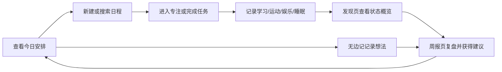

# CampusMind 智伴校园小程序详细技术与操作文档

更新日期：2026-06-02  
项目目录：`lifepilot-miniprogram`  
产品名称：`CampusMind`  
工程代号：`CampusMind`

命名说明：当前仓库目录仍为 `lifepilot-miniprogram`，但产品、页面标题、文档名称、云端用户可见名称和后续提交说明均统一使用 `CampusMind`。若后续允许调整工程目录，可将本地目录同步更名为 `campusmind-miniprogram`，但需要同时检查微信开发者工具项目配置中的 `miniprogramRoot`、`cloudfunctionRoot` 和私有配置文件路径。

[TOC]

## 1. 引言

### 1.1 项目背景

大学生的学习生活具有高度碎片化特征。课程、作业、实验、项目、社团、运动、娱乐、睡眠和个人复盘往往分散在多个工具中：课程表用于查看上课安排，备忘录用于记录临时想法，闹钟用于提醒任务，运动或睡眠记录又来自独立应用。多工具并行会带来三个问题：

1. 信息分散，用户需要在多个入口之间来回切换，难以及时判断“今天真正要做什么”。
2. 记录成本较高，学习、娱乐、运动、睡眠等生活状态难以被持续记录。
3. 缺少阶段性反馈，用户即使记录了很多数据，也很难把它们转化为可理解的生活节奏建议。

CampusMind 的设计出发点不是再做一个复杂的综合管理平台，而是围绕学生每天最高频的行为建立一个轻量闭环：查看当天安排、新建日程、记录状态、进入专注、写下无边记、查看周报。它将“日程管理”和“生活复盘”合在一个小程序里，让用户在低成本操作中逐渐看见自己的校园节奏。

### 1.2 项目目标

本项目基于微信小程序开发平台，使用微信云开发作为后端支撑，构建一个面向高校学生的校园生活辅助工具。核心目标如下：

- 让用户打开小程序后能立即看到今天的日程和任务。
- 让用户以较低成本创建课程、会议、作业、考试、个人安排等日程。
- 让日历不仅显示日期，还显示当天发生的日程和无边记内容。
- 将学习、运动、娱乐、睡眠等记录整合到“发现”和“周报”中。
- 提供番茄钟和无边记，支持用户从安排进入行动，从行动进入复盘。
- 通过微信云函数隔离用户数据，为后续 AI 周报、自然语言日程解析、跨端同步等能力预留接口。

### 1.3 当前版本定位

当前版本的核心定位可以概括为：

```text
校园日程管理 + 无边记记录 + 专注行动 + 生活状态周报
```

当前版本已经取消早期“文献总结”方向，避免功能过散，转而围绕学生真实校园生活中的高频任务展开：看今天、排日程、查日历、进专注、记状态、看周报。

## 2. 用户与需求分析

### 2.1 目标用户

主要用户为高校学生，尤其是同时面临课程、作业、考试、项目、社团、运动、娱乐和作息管理压力的学生群体。

用户特征如下：

- 日程来源分散，课程、会议、作业、考试和个人计划经常混在一起。
- 需要快速知道“今天要做什么”，而不是进入复杂的任务管理系统。
- 希望记录学习、娱乐、运动和睡眠情况，但不愿进行繁琐填写。
- 需要阶段性反馈，帮助自己调整学习节奏和生活节奏。
- 对工具的连续使用意愿较脆弱，因此页面必须直接、轻量、可快速完成任务。

### 2.2 用户痛点

| 痛点 | 具体表现 | 设计回应 |
| --- | --- | --- |
| 今日安排不清晰 | 打开多个工具才能知道课程、作业和待办 | 默认首页为今日日程 |
| 新建任务成本高 | 表单太复杂会导致用户放弃记录 | 使用接近系统日历的表单结构 |
| 月度规划不可见 | 只看列表难以感知一段时间的安排密度 | 提供完整月历视图 |
| 临时想法难保存 | 灵感、日记、课堂记录容易散落 | 设计无边记入口 |
| 记录无法复盘 | 学习和生活数据记录后没有反馈 | 发现页和周报页进行聚合展示 |
| 行动与计划脱节 | 有日程但缺少开始执行的入口 | 加入番茄钟选择和计时页面 |

### 2.3 核心使用场景

| 场景 | 用户目标 | 对应功能 |
| --- | --- | --- |
| 早上打开小程序 | 快速查看当天课程、会议和任务 | 今日日程 |
| 收到新任务 | 低成本创建日程并设置时间、提醒、地点 | 新建日程 |
| 复盘某一天 | 查看当天安排、笔记和灵感内容 | 日历日期浮层 |
| 想开始学习 | 选择任务或专注类型后进入计时 | 番茄钟 |
| 睡前记录状态 | 记录学习、娱乐、运动、睡眠和心情 | 生活记录 |
| 周末复盘 | 查看本周生活数据、图表和建议 | 数据化周报 |
| 想记临时想法 | 快速进入自由文本记录 | 无边记 |

## 3. 设计目标

1. 降低入口复杂度：底部导航只保留 4 个一级入口，避免功能堆叠。
2. 强化“今天优先”：首页直接呈现今日日历和当日安排，满足最高频需求。
3. 保持轻量记录：生活数据采用滑块、简短输入和快速保存，降低填写负担。
4. 支持直接操作：通过点击、滑动、拖拽等直接操纵方式减少层级跳转。
5. 形成数据闭环：日程和记录最终汇总到发现页、详情页和周报页。
6. 保留扩展空间：自然语言解析、AI 周报建议、课程导入等作为后续增强方向。
7. 保护个人数据：用户数据按 openid 隔离，AI 读取个人内容必须由用户授权。

## 4. 信息架构

### 4.1 一级导航结构

当前小程序采用 4 个一级导航入口：

```text
今日日程  |  日历视图  |  发现  |  我的
```

底部导航使用自定义 `tabBar`，仅显示图标，不显示文字。这样可以让页面视觉更轻，同时把文本空间留给页面内容本身。当前 `app.json` 中配置的页面顺序如下：

```text
pages/login/login
pages/home/home
pages/calendar/calendar
pages/discover/discover
pages/mine/mine
pages/search/search
pages/scheduleAdd/scheduleAdd
pages/schedule/schedule
pages/record/record
pages/report/report
pages/sport/sport
pages/entertainment/entertainment
pages/sleep/sleep
pages/pomodoroSelect/pomodoroSelect
pages/pomodoroTimer/pomodoroTimer
pages/boundlessNote/boundlessNote
```

### 4.2 页面结构

```text
lifepilot-miniprogram/
├─ miniprogram/
│  ├─ pages/
│  │  ├─ login/            # 登录与用户进入
│  │  ├─ home/             # 今日日程，默认首页
│  │  ├─ calendar/         # 月历视图、日期浮层、无边记管理
│  │  ├─ discover/         # 学习、运动、娱乐、睡眠概览
│  │  ├─ mine/             # 个人资料、目标、隐私授权
│  │  ├─ search/           # 日程搜索
│  │  ├─ scheduleAdd/      # 新建日程
│  │  ├─ schedule/         # 课程表、日程导入和解析预留
│  │  ├─ record/           # 生活状态记录
│  │  ├─ report/           # 数据化周报
│  │  ├─ sport/            # 运动详情
│  │  ├─ entertainment/    # 娱乐详情
│  │  ├─ sleep/            # 睡眠详情
│  │  ├─ pomodoroSelect/   # 专注任务选择
│  │  ├─ pomodoroTimer/    # 番茄钟计时
│  │  └─ boundlessNote/    # 无边记编辑
│  ├─ custom-tab-bar/      # 自定义底部导航
│  ├─ utils/
│  │  ├─ cloud.js          # 前端统一云函数调用层
│  │  ├─ storage.js        # 本地缓存与离线降级
│  │  ├─ analytics.js      # 本地概览和周报计算
│  │  └─ date.js           # 日期工具
│  └─ assets/              # 图标与图片资源
└─ cloudfunctions/
   ├─ userService/         # 用户登录、初始化、资料更新
   ├─ scheduleService/     # 日程创建、查询、搜索、解析
   ├─ noteService/         # 无边记创建、查询、删除
   └─ recordService/       # 生活记录、番茄钟、概览、周报
```

### 4.3 功能闭环



## 5. 视觉与交互规范

### 5.1 整体风格

CampusMind 采用清爽的校园工具风格。页面以白色和浅灰背景为主，红色用于关键状态、选中日期和主要行动，蓝色、绿色、紫色、橙色等用于区分生活数据类型。

视觉原则：

- 页面保持轻量，不使用过多装饰性元素。
- 关键操作使用明确的颜色和位置。
- 卡片只用于承载独立信息块，避免层层嵌套。
- 图表和分类数据使用多色区分，避免单一色系造成识别困难。
- 文案尽量短，避免在移动端产生换行挤压。

### 5.2 底部导航

底部导航采用自定义 `tabBar`：

- 4 个图标入口。
- 不显示文字。
- 选中态为红色。
- 未选中态为灰色。
- 图标保持较大尺寸，便于点击。

设计理由：

- 4 个入口降低认知负担。
- 图标化导航让页面更轻，但图标语义必须清晰。
- 选中态颜色与日历中的今日状态保持一致。

### 5.3 直接操纵

当前项目使用了多种直接操纵方式：

- 今日页月历上下滑动切换月份。
- 今日页和日历页日程项左滑删除。
- 日历页点击日期打开浮层。
- 日历浮层上下拖动改变高度。
- 日历浮层内部左右切换内容。
- 生活记录通过滑块调整数值。

这些交互符合人机交互课程中“直接操纵”的思想：用户通过点击、滑动、拖拽直接作用于界面对象，减少传统表单和多级菜单带来的操作负担。

### 5.4 页面退出与返回规范

当前版本中搜索、番茄钟、无边记、详情页等非一级页面存在退出路径不明确的问题。后续所有非 tabBar 页面必须提供明确的退出或返回方式。

规范如下：

- 所有由 `wx.navigateTo` 打开的二级页面，顶部左侧提供返回按钮。
- 搜索页顶部提供返回或取消入口，用户可回到来源页。
- 番茄钟选择页提供返回按钮。
- 番茄钟计时页提供退出专注按钮，点击后弹出确认框，避免误触中断计时。
- 无边记编辑页提供保存并返回、直接返回两种路径；若有未保存内容，返回前提示用户。
- 保存、删除、退出等关键操作必须提供 toast、modal 或页面状态反馈。
- 对于自定义导航栏页面，需要自行适配胶囊按钮安全区，避免按钮被微信右上角胶囊遮挡。

## 6. 技术架构

### 6.1 技术栈

| 层级 | 技术/框架 | 说明 |
| --- | --- | --- |
| 小程序前端 | 微信小程序 WXML / WXSS / JavaScript | 页面、组件、交互与本地缓存 |
| 组件框架 | `glass-easel` | `app.json` 中启用的小程序组件框架 |
| 渲染配置 | Skyline 渲染增强 | `project.config.json` 中启用 `skylineRenderEnable` |
| 云开发 | 微信云开发 | 云函数、云数据库、云存储能力 |
| 云函数运行时 | Node.js + `wx-server-sdk` | 用户、日程、记录、笔记、提醒、报告服务 |
| OCR/ASR | 腾讯云 SDK | 课程图片识别、语音识别 |
| AI 解析/周报 | DeepSeek API | 自然语言日程解析、AI 周报生成 |
| 本地缓存 | `wx.getStorageSync` / `wx.setStorageSync` | 离线降级、草稿和本地记录 |

### 6.2 工程结构

```text
lifepilot-miniprogram/
  project.config.json              # 微信开发者工具项目配置
  miniprogram/                      # 小程序前端
    app.js                          # 应用启动、云环境初始化、登录状态同步
    app.json                        # 页面路由、窗口、底部导航、组件框架配置
    app.wxss                        # 全局样式
    custom-tab-bar/                 # 自定义底部导航
    pages/                          # 页面目录
    utils/                          # 通用工具、云函数调用、本地缓存和统计计算
    assets/                         # 图标、装饰图、tabbar 资源
  cloudfunctions/                   # 云函数目录
    userService/                    # 用户服务
    scheduleService/                # 日程服务
    noteService/                    # 无边记/笔记服务
    recordService/                  # 生活记录、番茄钟和周报基础统计
    reminderService/                # 日程提醒扫描与发送
    reportService/                  # AI 周报生成
    speechService/                  # 语音识别
    ocrCourseService/               # 课表图片 OCR 与课程解析
```

### 6.3 启动流程

1. 小程序启动后读取本地登录状态键 `lifepilot_login_status`。
2. 调用 `wx.cloud.init` 初始化云环境，当前环境 ID 为 `cloud1-d0gqsqpco88878b2f`。
3. 如果没有登录状态，跳转到 `/pages/login/login`。
4. 如果已有登录状态，调用 `userService.init` 尝试初始化云端集合，再调用 `userService.login` 同步用户资料。
5. `syncUserData` 将云端用户信息写入 `globalData.user`，供“我的”、发现页、记录和周报等页面使用。

## 7. 页面与功能点

### 7.1 登录页 `pages/login/login`

功能点：

- 展示用户进入 CampusMind 的入口。
- 调用 `userService.login` 获取或创建用户记录。
- 新用户或资料未完成用户进入“我的”页补全信息。
- 已完成资料的用户进入“今日”页。
- 登录状态写入本地缓存，便于下次启动自动进入。

用户操作：

1. 打开小程序。
2. 在登录页点击进入/授权按钮。
3. 如果是新用户，进入“我的”页填写个人资料。
4. 如果是老用户，直接进入今日日程。

### 7.2 今日日程 `pages/home/home`

功能点：

- 默认首页，展示当前月、日期网格和选中日期的日程列表。
- 支持上下滑动切换月份。
- 日期下方用圆点标记当天是否有日程。
- 点击日期后刷新下方日程。
- 顶部提供搜索入口和新增日程入口。
- 支持日程左滑删除。
- 支持点击日程进入编辑。
- 支持重复日程的单次删除和全部删除。
- 提供无边记入口，可按日期创建、查看、编辑、删除笔记。
- 云端不可用时使用本地 `lifepilot_schedules` 与 `lifepilot_boundless_notes` 降级展示。

用户操作：

1. 进入“今日”页查看默认选中的今天。
2. 点击其他日期查看该日安排。
3. 点击加号进入新建日程。
4. 点击搜索进入搜索页。
5. 左滑日程删除；重复日程可选择删除本次或全部。
6. 点击无边记入口记录当天想法。

### 7.3 日历视图 `pages/calendar/calendar`

功能点：

- 以月历网格展示整月安排。
- 支持左右按钮切换月份。
- 单元格中显示当天短标题或日程密度。
- 点击日期打开底部浮层。
- 浮层展示详细日程、无边记和灵感记录。
- 浮层支持拖拽调整高度。
- 浮层内支持左右滑动切换内容区。
- 日程支持编辑、删除、重复日程单次/全部处理。
- 无边记支持创建、编辑、删除。

用户操作：

1. 切换到“日历”页。
2. 点击某一天打开底部浮层。
3. 在浮层中查看当日日程和笔记。
4. 拖动浮层顶部调整显示高度。
5. 点击日程编辑，或左滑删除。
6. 点击无边记入口编辑当天记录。

### 7.4 搜索页 `pages/search/search`

功能点：

- 支持关键词搜索日程和课程。
- 云端调用 `scheduleService.search`。
- 搜索字段包括标题、名称、课程名、类型、地点、教室、日期和备注。
- 前端对结果进行标准化与去重。
- 结果展示标题、时间、日期、地点和分类标签。
- 空关键词或无结果时展示空状态。

用户操作：

1. 在今日页点击搜索图标。
2. 输入关键词，例如课程名、地点、任务名或日期。
3. 点击结果查看对应事项。
4. 通过返回入口回到今日页。

### 7.5 新建/编辑日程 `pages/scheduleAdd/scheduleAdd`

功能点：

- 支持新建和编辑两种模式。
- 字段包括标题、地点、全天开关、开始日期、开始时间、结束日期、结束时间、重复规则、重复结束日期、提醒、URL、备注和长文本。
- 默认开始时间为当前时间向上取整到半小时，默认结束时间为开始后一小时。
- 支持非全天日程的时间合法性校验。
- 支持创建、编辑、删除日程。
- 支持重复日程编辑：仅修改本次或修改全部。
- 支持重复日程删除：仅删除本次或删除全部。
- 支持提醒配置，写入 `reminder` 对象。
- 支持语音输入入口，可调用 `speechService.recognize` 与 `scheduleService.parse` 解析自然语言。
- 保存时同时写入本地缓存，并调用 `scheduleService.create/update` 同步云端。

用户操作：

1. 从今日页或日历页点击新增/编辑。
2. 填写标题、时间、地点和提醒等信息。
3. 点击保存。
4. 如果编辑重复日程，按弹窗选择“仅本次”或“全部重复日程”。
5. 返回今日页或日历页查看更新结果。

### 7.6 课表与日程管理 `pages/schedule/schedule`

功能点：

- 汇总展示本地课程和日程。
- 支持将课程提升为日程并同步云端。
- 支持点击日程进入编辑。
- 支持左滑删除。
- 可从“我的”页进入，用于课表/日程导入后的统一管理。

用户操作：

1. 在“我的”页进入课表与日程管理。
2. 查看导入的课程和手动创建的日程。
3. 点击事项编辑，或左滑删除。
4. 对课程类条目可转换/同步为日程。

### 7.7 发现页 `pages/discover/discover`

功能点：

- 展示本周学习、运动、娱乐、睡眠四类数据概览。
- 使用 `activityStats.buildDiscoverData` 从本地记录和番茄钟记录计算统计。
- 展示总时长、活跃模块、周趋势和模块卡片。
- 支持下拉刷新。
- 点击模块进入模块详情。
- 提供番茄钟入口。

用户操作：

1. 切换到“发现”页查看本周状态。
2. 点击学习、运动、娱乐或睡眠卡片查看详情。
3. 点击专注入口进入番茄钟选择页。
4. 下拉刷新更新本地统计。

### 7.8 发现模块详情 `pages/discoverModule/discoverModule`

功能点：

- 按模块展示一周趋势图、今日时长、本周累计、记录数等指标。
- 展示该模块关联的手动记录和番茄钟记录。
- 提供新增该模块记录入口。

用户操作：

1. 从发现页点击某个模块。
2. 查看趋势和记录明细。
3. 点击新增记录进入 `recordModule`。

### 7.9 生活记录总览 `pages/record/record`

功能点：

- 展示最近生活记录。
- 支持进入四类模块记录：学习、运动、娱乐、睡眠。
- 从本地 `lifepilot_records` 读取记录。
- 可作为用户补充每日状态的入口。

用户操作：

1. 从“我的”页或模块详情进入生活记录。
2. 查看最近记录。
3. 点击某类记录进入具体录入页。

### 7.10 模块记录 `pages/recordModule/recordModule`

功能点：

- 支持按模块记录标题、时长、开始时间、结束时间和备注。
- 支持学习、运动、娱乐、睡眠四类模块。
- 记录写入本地 `lifepilot_records`。
- 同步调用 `recordService.createRecord`。
- 保存后清空表单。

用户操作：

1. 选择模块。
2. 填写时长、时间和备注。
3. 点击保存。
4. 返回发现页或详情页查看统计变化。

### 7.11 番茄钟选择 `pages/pomodoroSelect/pomodoroSelect`

功能点：

- 提供不同模块或任务的专注入口。
- 选择后跳转到番茄钟计时页。
- 可用于学习、运动、娱乐、睡眠等模块的计时记录。

用户操作：

1. 从发现页进入番茄钟。
2. 选择专注类型或任务。
3. 进入计时页开始专注。

### 7.12 番茄钟计时 `pages/pomodoroTimer/pomodoroTimer`

功能点：

- 接收分类、标题、时长等参数。
- 展示倒计时界面。
- 支持开始、暂停、继续和结束。
- 结束后生成本地番茄钟记录。
- 调用 `recordService.createPomodoro` 同步云端。
- 云端同步后可累计到生活记录和关联日程的 `focusMinutes`。

用户操作：

1. 在选择页点击一个番茄钟任务。
2. 点击开始计时。
3. 中途可暂停或继续。
4. 结束后保存专注记录。
5. 在发现页、模块详情或番茄钟列表查看统计。

### 7.13 番茄钟列表 `pages/pomodoroList/pomodoroList`

功能点：

- 展示历史番茄钟记录。
- 支持删除番茄钟记录。
- 删除时本地调用 `deletePomodoroRecord`，云端调用 `recordService.deletePomodoro`。

用户操作：

1. 进入番茄钟记录列表。
2. 查看历史专注时间。
3. 删除不需要的记录。

### 7.14 无边记编辑 `pages/boundlessNote/boundlessNote`

功能点：

- 支持新建、编辑、草稿和查看模式。
- 支持文本记录。
- 支持图片、拍照、位置、录音、扫描文本等附件。
- 支持录音播放。
- 支持未保存内容离开前提醒。
- 支持保存草稿并退出。
- 支持删除当前笔记。
- 本地写入 `lifepilot_boundless_notes`。
- 云端调用 `noteService.create/delete`。

用户操作：

1. 从今日页、日历页或笔记列表进入无边记。
2. 输入文本，或添加附件。
3. 可录音、拍照、选择位置或扫描文字。
4. 点击保存。
5. 未保存时返回会提示是否离开。

### 7.15 无边记列表 `pages/noteList/noteList`

功能点：

- 按日期分组展示无边记。
- 支持进入笔记详情编辑。
- 支持删除笔记。
- 与“我的”页的最近无边记联动。

用户操作：

1. 从“我的”页点击无边记入口。
2. 按日期查看历史记录。
3. 点击记录编辑。
4. 删除不需要的记录。

### 7.16 我的 `pages/mine/mine`

功能点：

- 展示用户昵称、头像、学校、专业、年级和目标信息。
- 支持保存个人资料。
- 支持学习目标、运动目标、睡眠目标、娱乐限制配置。
- 支持 AI 权限开关，例如日记/笔记/记录/周报是否允许 AI 使用。
- 展示最近无边记。
- 支持左滑删除最近无边记。
- 提供课表导入、生活记录、周报、番茄钟记录、无边记列表等入口。
- 支持选择课表图片并调用 `ocrCourseService` 识别课程。
- 将识别出的课程转换为本地课程/日程，并可同步到 `scheduleService.create`。

用户操作：

1. 切换到“我的”页。
2. 编辑学校、专业、年级和目标。
3. 点击保存资料。
4. 管理 AI 授权开关。
5. 进入课表、周报、生活记录、无边记等功能。
6. 选择课表图片导入课程。

### 7.17 周报 `pages/report/report`

功能点：

- 汇总本周学习、娱乐、运动、睡眠数据。
- 展示五维评分或多指标统计。
- 展示建议、风险和下周重点。
- 调用 `recordService.getWeeklyReport` 生成基础统计。
- 可调用 `reportService.generateWeeklyReport` 使用 DeepSeek 生成 AI 周报。
- 可调用 `reportService.generateShareSummary` 生成分享摘要。

用户操作：

1. 从发现页或“我的”页进入周报。
2. 查看本周统计指标。
3. 根据建议调整下周安排。
4. 如已配置 AI 服务，可生成更完整的文字周报。

### 7.18 运动详情 `pages/sport/sport`

功能点：

- 展示运动相关统计。
- 使用全局目标和本地记录计算运动状态。
- 提供进入生活记录的入口。

用户操作：

1. 从发现页或模块入口进入运动详情。
2. 查看运动次数、时长、目标完成情况。
3. 点击记录入口补充运动记录。

### 7.19 娱乐详情 `pages/entertainment/entertainment`

功能点：

- 展示娱乐时长和娱乐限制相关信息。
- 基于用户设置的 `entertainmentLimit` 提示状态。
- 提供进入生活记录的入口。

用户操作：

1. 进入娱乐详情。
2. 查看本周娱乐时长和限制情况。
3. 需要补充时进入记录页。

### 7.20 睡眠详情 `pages/sleep/sleep`

功能点：

- 展示睡眠时长、目标和状态。
- 基于用户 `sleepGoal` 计算提示。
- 提供进入生活记录的入口。

用户操作：

1. 进入睡眠详情。
2. 查看平均睡眠和目标差距。
3. 补充睡眠记录。

### 7.21 通用自定义底部导航 `custom-tab-bar`

功能点：

- 四个一级入口：今日、日历、发现、我的。
- 仅显示图标，不显示文字。
- 选中态使用红色图标。
- 点击后使用 `wx.switchTab` 切换页面。

## 8. 云函数与接口

所有前端云函数调用统一封装在 `miniprogram/utils/cloud.js`。返回结果通过 `normalizeResult` 标准化：当返回 `code !== 0` 时抛出错误，否则返回 `{ code, message, data }`。

### 8.1 `userService`

集合：`users`、`schemaVersions`，并负责初始化其他集合。

| action | 功能 | 主要入参 | 返回 |
| --- | --- | --- | --- |
| `login` | 登录或创建用户 | `nickName`、`avatarUrl`、资料字段 | `user`、`isNewUser` |
| `init` | 初始化数据库集合和 schema 版本 | 用户信息可选 | 集合初始化结果 |
| `updateProfile` | 更新用户资料和权限 | 学校、专业、目标、AI 权限 | 更新后的用户 |
| `getProfile` | 获取用户资料和目标 | 无 | `user`、`goals` |

用户默认配置：

```js
{
  studyGoal: 25,
  sportGoal: 3,
  sleepGoal: 8,
  entertainmentLimit: 600
}
```

### 8.2 `scheduleService`

集合：`schedules`、`courses`。

| action | 功能 | 说明 |
| --- | --- | --- |
| `create` | 创建日程 | 支持 `clientId` 去重，已有则更新 |
| `update` | 更新日程 | 支持状态、优先级、时间、重复规则、提醒等字段 |
| `delete` | 删除日程 | 软删除，设置 `isDeleted: true` |
| `listByDate` | 查询某天日程 | 合并普通日程、重复日程和课程 |
| `listByMonth` | 查询月视图 | 返回每天日程数量和短列表 |
| `search` | 搜索日程和课程 | 支持多字段正则匹配 |
| `parse` | 自然语言日程解析 | 依赖 `DEEPSEEK_API_KEY` |

日程核心字段：

| 字段 | 说明 |
| --- | --- |
| `openid/userId` | 用户归属 |
| `clientId` | 前端本地 ID，用于离线合并和云端去重 |
| `title` | 标题 |
| `type` | `course/task/exam/meeting/habit/personal/schedule` |
| `dateKey/startDateKey/endDateKey` | 日期 |
| `startTime/endTime` | 时间 |
| `repeatRule` | 重复规则 |
| `excludedDates` | 重复日程中排除的日期 |
| `reminder` | 提醒配置 |
| `focusMinutes` | 关联专注时长 |
| `isDeleted` | 软删除标记 |

### 8.3 `noteService`

集合：`notes`。

| action | 功能 | 说明 |
| --- | --- | --- |
| `create` | 创建或更新笔记 | 支持 `clientId` 去重 |
| `delete` | 删除笔记 | 支持云端 ID 或 `clientId` |
| `listByDate` | 查询某日笔记 | 返回该日最多 50 条 |

笔记类型包括 `diary`、`idea`、`attachment`、`scan`、`audio`、`boundless`。无边记默认使用 `boundless`。

### 8.4 `recordService`

集合：`records`、`pomodoroSessions`、`reports`。

| action | 功能 | 说明 |
| --- | --- | --- |
| `createRecord` | 创建或更新每日生活记录 | 同一天记录存在时更新 |
| `createPomodoro` | 创建番茄钟记录 | 可同步累计到每日记录和日程专注时长 |
| `deletePomodoro` | 删除番茄钟记录 | 软删除 |
| `getOverview` | 获取发现页概览 | 读取一周记录和用户目标 |
| `getWeeklyReport` | 生成基础周报 | 可写入 `reports` |

生活记录字段：

| 字段 | 说明 |
| --- | --- |
| `date` | 日期 |
| `studyMinutes` | 学习分钟数 |
| `entertainmentMinutes` | 娱乐分钟数 |
| `sportMinutes/exerciseMinutes` | 运动分钟数 |
| `sleepHours` | 睡眠小时数 |
| `mood` | 心情 |
| `note` | 补充说明 |

番茄钟字段：

| 字段 | 说明 |
| --- | --- |
| `category` | `study/sport/entertainment/sleep` |
| `durationMinutes` | 专注时长 |
| `startedAt/endedAt` | 开始和结束时间 |
| `scheduleId` | 可选关联日程 |
| `completed` | 是否完成 |
| `exitReason` | 结束原因 |

### 8.5 `reminderService`

集合：`schedules`。

| action | 功能 | 说明 |
| --- | --- | --- |
| `scanDueReminders` | 扫描到期提醒 | 默认 action，也可由定时器触发 |
| `timer` | 定时器触发别名 | 与扫描逻辑一致 |
| `markReminderSent` | 标记提醒已发送 | 更新提醒发送状态 |

定时触发配置：

```json
{
  "name": "scanDueReminders",
  "type": "timer",
  "config": "0 */5 * * * * *"
}
```

含义：每 5 分钟扫描一次到期提醒。

### 8.6 `reportService`

功能：AI 周报生成和分享摘要生成。依赖环境变量 `DEEPSEEK_API_KEY`。

| action | 功能 |
| --- | --- |
| `generateWeeklyReport` | 根据统计、日程、笔记和番茄钟生成结构化周报 |
| `generateShareSummary` | 生成周报分享摘要 |

AI 周报输出结构：

```js
{
  title,
  summary,
  highlights,
  risks,
  suggestions,
  scheduleInsights,
  noteInsights,
  focusInsights,
  nextWeekFocus,
  shareText
}
```

### 8.7 `speechService`

功能：语音识别。依赖腾讯云 ASR 相关配置和 `tencentcloud-sdk-nodejs`。

| action | 功能 |
| --- | --- |
| `recognize` | 识别语音文件，返回文本 |

前端主要用于新建日程时的语音输入，再把识别文本交给 `scheduleService.parse` 解析成日程字段。

### 8.8 `ocrCourseService`

功能：课表图片 OCR 和课程结构化解析。依赖腾讯云 OCR、DeepSeek 和相关环境变量。

| action | 功能 |
| --- | --- |
| `recognizeText` | 仅识别图片文字 |
| 默认解析流程 | OCR 识别后调用 AI 解析课程 JSON |

课程解析后可转换为本地课程和日程，供“课表与日程管理”“今日”“日历”使用。

## 9. 本地缓存与降级

`miniprogram/utils/storage.js` 定义了核心缓存键：

| key | 用途 |
| --- | --- |
| `lifepilot_courses` | 本地课程 |
| `lifepilot_schedules` | 本地日程 |
| `lifepilot_records` | 本地生活记录和番茄钟记录 |
| `lifepilot_diaries` | 历史日记兼容数据 |
| `lifepilot_boundless_notes` | 无边记 |
| `lifepilot_user_settings` | 用户设置 |

降级策略：

1. 页面先保证本地可读写。
2. 保存日程、记录、笔记时先写本地，再异步调用云函数。
3. 云函数失败时保留本地数据，并输出控制台警告。
4. 云端数据拉取成功后，通过 `mergeSchedulesToStorage` 合并到本地，避免重复数据。
5. 日程去重优先使用 `_id`、`clientId`、`cloudId`、`searchIndexId`。

## 10. 数据库集合设计

### 10.1 `users`

保存用户身份、资料、目标和 AI 权限。

主要字段：

- `openid`
- `userId`
- `nickName`
- `avatarUrl`
- `school`
- `major`
- `grade`
- `studyGoal`
- `sportGoal`
- `sleepGoal`
- `entertainmentLimit`
- `allowDiaryAI`
- `allowNoteAI`
- `allowRecordAI`
- `allowReportAI`
- `profileCompleted`
- `theme`
- `createdAt`
- `updatedAt`

### 10.2 `schedules`

保存用户手动创建或转换生成的日程。

主要字段：

- `openid`
- `clientId`
- `title`
- `type`
- `status`
- `priority`
- `location`
- `dateKey`
- `startDateKey`
- `endDateKey`
- `startTime`
- `endTime`
- `isAllDay/allDay`
- `repeatRule`
- `excludedDates`
- `reminder`
- `url`
- `note`
- `source`
- `color`
- `focusRequired`
- `focusMinutes`
- `isCountdown`
- `isDeleted`

### 10.3 `courses`

保存课表识别或导入后的课程数据。当前主要由课表 OCR 和本地转换流程使用。

建议字段：

- `openid`
- `courseName`
- `teacher`
- `classroom`
- `dateKey`
- `weekday`
- `startTime`
- `endTime`
- `startWeek`
- `endWeek`
- `weekType`
- `semester`
- `color`
- `isDeleted`

### 10.4 `records`

保存每日生活记录，也会接收番茄钟带来的学习/运动/娱乐增量。

主要字段：

- `openid`
- `date`
- `studyMinutes`
- `entertainmentMinutes`
- `sportMinutes`
- `exerciseMinutes`
- `sleepHours`
- `mood`
- `note`
- `createdAt`
- `updatedAt`

### 10.5 `pomodoroSessions`

保存番茄钟专注记录。

主要字段：

- `openid`
- `clientId`
- `scheduleId`
- `category`
- `durationMinutes`
- `startedAt`
- `endedAt`
- `completed`
- `exitReason`
- `isDeleted`
- `createdAt`

### 10.6 `notes`

保存无边记、日记、灵感和附件记录。

主要字段：

- `openid`
- `date`
- `type`
- `clientId`
- `content`
- `assets`
- `tags`
- `visibleToAI`
- `createdAt`
- `updatedAt`

### 10.7 `reports`

保存周报结果。

主要字段：

- `openid`
- `weekStart`
- `weekEnd`
- `studyTotal`
- `entertainmentTotal`
- `sportTotal`
- `avgSleep`
- `scores`
- `aiSummary`
- `suggestions`
- `createdAt`

### 10.8 `schemaVersions`

保存云端集合初始化版本。

当前版本：`2026-05-31-cloud-schema-v1`。

## 11. 主要业务流程

### 11.1 登录与资料初始化

```text
打开小程序
 -> 读取本地登录状态
 -> 未登录则进入登录页
 -> 调用 userService.login
 -> 新用户创建 users 记录
 -> 同步 globalData.user
 -> 资料未完成则进入我的页
 -> 资料完成则进入今日页
```

### 11.2 新建日程

```text
今日/日历点击新增
 -> scheduleAdd 填写表单
 -> 前端校验标题和时间
 -> 写入本地 lifepilot_schedules
 -> 调用 scheduleService.create
 -> 返回上一页刷新
```

### 11.3 重复日程单次编辑

```text
点击重复日程中的某一次
 -> 进入编辑页
 -> 修改后选择仅本次
 -> 原重复日程加入 excludedDates
 -> 创建一个单独的新日程
 -> 今日和日历同步刷新
```

### 11.4 查看某日完整记录

```text
进入日历页
 -> 点击日期
 -> 打开底部浮层
 -> 查询当日日程和无边记
 -> 在浮层内切换日程/无边记/灵感
```

### 11.5 创建无边记

```text
点击无边记入口
 -> 进入 boundlessNote
 -> 输入文本或添加附件
 -> 保存到本地 boundless_notes
 -> 调用 noteService.create
 -> 返回上一页刷新
```

### 11.6 创建生活记录

```text
发现模块/生活记录入口
 -> 进入 recordModule
 -> 填写时长、时间和备注
 -> 写入 lifepilot_records
 -> 调用 recordService.createRecord
 -> 发现页重新计算趋势
```

### 11.7 番茄钟专注

```text
发现页点击番茄钟
 -> 选择专注模块
 -> 进入计时页
 -> 开始/暂停/结束
 -> 本地生成 pomodoro 记录
 -> 调用 recordService.createPomodoro
 -> 追加到每日记录
 -> 如有关联日程则增加 focusMinutes
```

### 11.8 课表图片导入

```text
我的页选择课表导入
 -> 选择图片和 OCR 模式
 -> 调用 ocrCourseService
 -> OCR 提取文字
 -> AI 解析课程结构
 -> 用户确认后写入本地课程/日程
 -> 可调用 scheduleService.create 同步云端
```

### 11.9 AI 周报生成

```text
进入周报页
 -> 汇总 records、schedules、notes、pomodoro
 -> 基础周报可由 recordService.getWeeklyReport 生成
 -> AI 周报调用 reportService.generateWeeklyReport
 -> DeepSeek 返回结构化 JSON
 -> 页面展示总结、亮点、风险、建议和下周重点
```

## 12. 部署与运行

### 12.1 使用微信开发者工具打开

1. 打开微信开发者工具。
2. 选择“导入项目”。
3. 项目目录选择：

```text
D:\SE HM\用户交互设计\final_project\lifepilot-miniprogram
```

4. AppID 使用 `project.config.json` 中的：

```text
wx349e90f4e43c9127
```

5. 确认小程序目录为 `miniprogram/`，云函数目录为 `cloudfunctions/`。

### 12.2 云开发环境

当前代码中云环境 ID：

```js
cloud1-d0gqsqpco88878b2f
```

需要在微信开发者工具中确认：

- 已开通云开发。
- 当前环境 ID 与 `app.js` 中 `CLOUD_ENV` 一致。
- 云数据库权限允许云函数按 openid 访问用户数据。

### 12.3 云函数部署

需要部署的云函数：

```text
userService
scheduleService
noteService
recordService
reminderService
reportService
speechService
ocrCourseService
```

部署建议：

1. 在微信开发者工具中右键每个云函数目录。
2. 选择“上传并部署：云端安装依赖”。
3. OCR 和语音服务依赖 `tencentcloud-sdk-nodejs`，必须安装依赖。
4. 部署 `reminderService` 时确认定时触发器配置已生效。

### 12.4 环境变量配置

如需启用 AI、OCR、语音能力，需要配置相关环境变量。

| 能力 | 可能需要的配置 |
| --- | --- |
| DeepSeek 日程解析 | `DEEPSEEK_API_KEY` |
| DeepSeek 周报生成 | `DEEPSEEK_API_KEY` |
| 腾讯云 OCR | 腾讯云 SecretId、SecretKey、OCR 区域等 |
| 腾讯云 ASR | 腾讯云 SecretId、SecretKey、ASR 区域等 |
| 模板消息提醒 | 小程序订阅消息模板 ID |

如果未配置这些变量，核心日程、记录、无边记、发现页仍可使用，但 AI 解析、AI 周报、OCR、语音识别和提醒发送可能失败。

### 12.5 需要额外配置的云函数 API 与处理时间

下列云函数依赖外部 API、订阅消息模板或定时触发器。部署演示前应优先检查这些配置，否则对应功能会返回错误或降级为手动流程。

| 云函数 | 依赖 API/服务 | 必要配置 | 典型处理时间 | 代码超时/扫描窗口 | 失败影响 |
| --- | --- | --- | --- | --- | --- |
| `scheduleService.parse` | DeepSeek Chat Completions | `DEEPSEEK_API_KEY` | 2-8 秒 | HTTPS 请求超时 20 秒 | 无法把自然语言解析成日程，用户仍可手动填写 |
| `reportService.generateWeeklyReport` | DeepSeek Chat Completions | `DEEPSEEK_API_KEY` | 3-12 秒 | HTTPS 请求超时 20 秒 | 无法生成 AI 周报，基础统计仍可由 `recordService.getWeeklyReport` 提供 |
| `reportService.generateShareSummary` | DeepSeek Chat Completions | `DEEPSEEK_API_KEY` | 3-12 秒 | 复用 AI 周报生成流程 | 无法生成分享摘要 |
| `ocrCourseService` | 腾讯云 OCR + DeepSeek Chat Completions | `TENCENT_SECRET_ID`、`TENCENT_SECRET_KEY`、解析课程时还需 `DEEPSEEK_API_KEY` | 仅 OCR 1-5 秒；OCR + AI 解析 5-15 秒 | 代码未显式设置请求超时，受云函数运行时和外部 API 响应影响 | 无法识别课表图片；可改为手动录入课程 |
| `speechService.recognize` | 腾讯云 ASR 一句话识别 | `ASR_SECRET_ID`、`ASR_SECRET_KEY`；可选 `ASR_REGION`、`ASR_PROJECT_ID`、`ASR_ENGINE_MODEL`、`SPEECH_RECOGNITION_PROVIDER` | 1-6 秒 | 代码未显式设置请求超时，受云函数运行时和腾讯 ASR 响应影响 | 无法将语音转文字；用户仍可手动输入 |
| `reminderService.scanDueReminders` | 微信订阅消息 `cloud.openapi.subscribeMessage.send` | 日程 `reminder.templateId`、用户订阅状态 `reminder.subscribed`、定时触发器 | 每次扫描通常 1 秒内；发送数量多时随 due 数增长 | 定时触发器每 5 分钟执行一次；扫描最近 10 分钟提醒窗口；每次最多读取 100 条日程 | 无法推送提醒，但日程本身不受影响 |

#### DeepSeek 配置说明

项目中有两处使用 DeepSeek：

1. `scheduleService.parse`：把一句话日程描述解析为标题、日期、开始时间、结束时间、地点、提醒和重复规则。
2. `reportService.generateWeeklyReport` / `generateShareSummary`：根据本周统计、日程、无边记和番茄钟数据生成周报。
3. `ocrCourseService`：在 OCR 得到课表文字后，调用 DeepSeek 把原始文字整理成课程 JSON。

需要在对应云函数环境变量中配置：

```text
DEEPSEEK_API_KEY=你的 DeepSeek API Key
```

当前代码请求地址：

```text
https://api.deepseek.com/chat/completions
```

当前模型：

```text
deepseek-chat
```

处理时间建议：

- 普通日程解析文本较短，通常按 2-8 秒估算。
- 周报输入包含统计、日程、笔记和番茄钟数据，通常按 3-12 秒估算。
- 代码中 DeepSeek HTTPS 请求设置了 20 秒超时；如果 20 秒内没有返回，会进入失败逻辑。
- 页面侧应展示加载状态，避免用户重复点击生成。

#### 腾讯云 OCR 配置说明

`ocrCourseService` 用于课表图片识别。处理分两步：

1. 调用腾讯云 OCR 识别图片文字。
2. 如果 action 不是 `recognizeText`，继续调用 DeepSeek 将 OCR 文本解析为课程数组。

需要配置：

```text
TENCENT_SECRET_ID=腾讯云 SecretId
TENCENT_SECRET_KEY=腾讯云 SecretKey
DEEPSEEK_API_KEY=你的 DeepSeek API Key
```

OCR 区域和端点在代码中固定为：

```text
region: ap-guangzhou
endpoint: ocr.tencentcloudapi.com
```

支持的 OCR 模式：

| mode | 腾讯云 Action | 使用场景 |
| --- | --- | --- |
| `printed` | `GeneralBasicOCR` | 普通印刷文字，速度较快 |
| `accurate` | `GeneralAccurateOCR` | 默认模式，准确率更高 |
| `handwriting` | `GeneralHandwritingOCR` | 手写课表或手写备注 |

处理时间建议：

- 仅识别文字：通常 1-5 秒。
- 识别文字并解析课程：通常 5-15 秒。
- 图片越大、文字越密集、课程越多，处理时间越长。
- 代码未对 OCR 请求显式设置独立超时，实际受腾讯云 API、DeepSeek API 和云函数运行时限制影响。

#### 腾讯云 ASR 配置说明

`speechService.recognize` 用于日程语音输入。前端上传音频后，云函数先获取临时文件 URL，再调用腾讯云 ASR 一句话识别。

需要配置：

```text
ASR_SECRET_ID=腾讯云 SecretId
ASR_SECRET_KEY=腾讯云 SecretKey
```

可选配置：

```text
ASR_REGION=腾讯云 ASR 区域
ASR_PROJECT_ID=项目 ID，默认 0
ASR_ENGINE_MODEL=识别模型，默认 16k_zh
SPEECH_RECOGNITION_PROVIDER=tencent
```

支持的音频格式会被标准化为：

```text
wav, pcm, ogg-opus, speex, silk, mp3, m4a, aac, amr
```

处理时间建议：

- 60 秒以内的短语音通常按 1-6 秒估算。
- 当前无边记录音上限为 60 秒；日程语音输入也建议控制在短句范围内。
- 如果未配置 ASR 密钥，云函数返回 `501`。
- 如果没有识别出文本，云函数返回 `204`。

#### 订阅提醒配置说明

`reminderService` 用于扫描并发送日程提醒。它依赖微信订阅消息能力，不是普通 HTTP API。

需要满足：

1. 用户已订阅对应消息模板。
2. 日程 `reminder.enabled` 为 `true`。
3. 日程 `reminder.subscribed` 为 `true`。
4. 日程 `reminder.templateId` 已配置。
5. 日程 `reminder.remindAt` 是可解析时间。
6. `reminder.sent` 不是 `true`。

定时触发器配置为：

```json
{
  "name": "scanDueReminders",
  "type": "timer",
  "config": "0 */5 * * * * *"
}
```

处理时间和扫描规则：

- 每 5 分钟自动扫描一次。
- 每次读取最多 100 条未删除日程。
- 只发送当前时间往前 10 分钟窗口内到期的提醒。
- 成功发送后写入 `reminder.sent=true` 和 `lastSentAt`。
- 发送失败时写入 `lastCheckedAt` 和 `lastError`。

#### 云函数超时配置建议

微信云函数自身还需要在云开发控制台设置合理的执行超时时间。建议如下：

| 云函数 | 建议超时时间 | 理由 |
| --- | --- | --- |
| `userService` | 5-10 秒 | 主要是数据库读写 |
| `scheduleService` | 10 秒；启用 `parse` 时建议 30 秒 | 普通日程读写较快，AI 解析最多可能接近 20 秒 |
| `noteService` | 5-10 秒 | 主要是数据库读写和附件元数据保存 |
| `recordService` | 5-10 秒 | 主要是记录、番茄钟和统计读写 |
| `reminderService` | 10-20 秒 | 需要扫描和发送订阅消息 |
| `reportService` | 30 秒 | AI 周报请求可能接近 20 秒 |
| `speechService` | 20-30 秒 | 需要获取临时文件 URL 并调用 ASR |
| `ocrCourseService` | 30-60 秒 | OCR + AI 解析链路最长 |

演示建议：

- 普通日程、记录、无边记、发现页和基础周报作为稳定主流程。
- AI 周报、语音识别、课表 OCR 和订阅提醒作为增强能力，演示前先单独测试云函数。
- 对耗时超过 3 秒的功能，页面应保持 loading 状态并禁止重复提交。

### 12.6 数据库初始化

首次进入小程序或登录后，`app.js` 会调用：

```js
api.user.init()
```

该接口会尝试创建以下集合：

```text
users
courses
schedules
records
pomodoroSessions
notes
reports
schemaVersions
```

如果集合已存在，云函数会跳过创建并继续执行。

## 13. 操作手册

### 13.1 查看今天安排

1. 打开小程序并登录。
2. 默认进入“今日”页。
3. 查看当前选中日期下方的日程列表。
4. 点击其他日期可切换当天安排。

### 13.2 新增日程

1. 在“今日”页点击加号。
2. 填写标题。
3. 选择开始时间和结束时间。
4. 可选填地点、提醒、重复、URL 和备注。
5. 点击保存。
6. 返回今日页查看新增日程。

### 13.3 编辑日程

1. 在今日页或日历浮层点击日程。
2. 修改内容。
3. 点击保存。
4. 如果是重复日程，选择修改本次或全部。

### 13.4 删除日程

1. 在日程列表中左滑目标日程。
2. 点击删除。
3. 如果是重复日程，选择删除本次或删除全部。

### 13.5 搜索事项

1. 在今日页点击搜索。
2. 输入关键词。
3. 查看搜索结果。
4. 点击结果查看或处理。

### 13.6 查看月历

1. 切换到底部第二个“日历”入口。
2. 使用左右按钮切换月份。
3. 点击日期打开底部浮层。
4. 查看该日详细安排和无边记。

### 13.7 记录无边记

1. 在今日页、日历页或“我的”页进入无边记。
2. 输入文字。
3. 可添加图片、位置、录音或扫描文本。
4. 点击保存。
5. 历史记录可在无边记列表查看。

### 13.8 记录生活状态

1. 从发现页模块详情或“我的”页进入生活记录。
2. 选择学习、运动、娱乐或睡眠。
3. 填写时长、时间和备注。
4. 保存后返回发现页查看趋势。

### 13.9 使用番茄钟

1. 在发现页点击番茄钟入口。
2. 选择专注模块或任务。
3. 点击开始。
4. 可暂停、继续或结束。
5. 结束后记录会进入统计。

### 13.10 查看发现页统计

1. 切换到底部“发现”入口。
2. 查看本周总时长和活跃模块。
3. 点击模块卡片查看详情。
4. 下拉刷新更新数据。

### 13.11 查看周报

1. 从“我的”页或发现页进入周报。
2. 查看本周学习、娱乐、运动和睡眠统计。
3. 查看建议和下周重点。
4. 若配置 AI 服务，可生成 AI 周报。

### 13.12 导入课表

1. 进入“我的”页。
2. 点击课表导入相关入口。
3. 选择课表图片。
4. 等待 OCR 和 AI 解析。
5. 检查识别课程。
6. 确认后写入课程/日程。

### 13.13 编辑个人资料和权限

1. 进入“我的”页。
2. 修改学校、专业、年级和目标。
3. 设置是否允许 AI 使用记录、笔记或周报数据。
4. 点击保存。

## 14. 测试与验收清单

| 模块 | 验收项 |
| --- | --- |
| 登录 | 新用户可创建用户记录，老用户可直接进入首页 |
| 资料 | 个人资料保存后刷新仍保留 |
| 今日 | 可查看当天日程，可切换日期 |
| 新建日程 | 标题必填，结束时间不能早于开始时间 |
| 编辑日程 | 普通日程可保存，重复日程可选择本次/全部 |
| 删除日程 | 普通日程可删除，重复日程可选择本次/全部 |
| 搜索 | 输入关键词后能搜索日程和课程 |
| 日历 | 点击日期能打开浮层并展示详情 |
| 无边记 | 文本和附件可保存，未保存离开有提醒 |
| 生活记录 | 记录保存后发现页统计更新 |
| 番茄钟 | 开始、暂停、结束流程正常，结束后生成记录 |
| 周报 | 有记录时生成统计，无记录时展示空状态或默认建议 |
| OCR | 配置环境变量后可识别课表图片 |
| 语音 | 配置环境变量后可识别语音文本 |
| 提醒 | 定时扫描触发器正常，提醒发送后可标记已发送 |
| 离线降级 | 云端失败时本地记录不丢失 |

## 15. 可用性评估方案

### 15.1 测试任务

为了验证设计是否满足用户需求，可进行轻量用户测试。建议每位测试者完成以下任务：

1. 找到今天下午的安排。
2. 新增一个明天下午 3 点的组会日程。
3. 在日历中查看某一天的详细记录。
4. 新建一条无边记，记录一段课堂灵感。
5. 记录今天的学习、娱乐、运动和睡眠情况。
6. 开始一次 25 分钟专注。
7. 找到本周周报，并说出本周最需要调整的生活状态。
8. 首次登录后填写并保存基本信息。
9. 修改个人信息后退出并重新进入，检查信息是否保留。
10. 从搜索页、番茄钟页和无边记页返回上一页。

### 15.2 评价指标

| 指标 | 观察方式 |
| --- | --- |
| 完成率 | 用户能否独立完成任务 |
| 完成时间 | 每个任务耗时是否过长 |
| 错误次数 | 是否频繁点错入口或返回 |
| 入口理解度 | 用户能否理解四个底部导航含义 |
| 表单负担 | 新建日程和生活记录是否显得繁琐 |
| 反馈清晰度 | 保存、删除、搜索后用户是否知道结果 |
| 复盘价值 | 用户是否认为周报建议有帮助 |
| 退出可见性 | 用户是否能快速找到返回和退出入口 |
| 数据一致性 | 同一日程是否在搜索、今日、日历中保持一致 |

### 15.3 访谈问题

- 打开首页后，你能否快速知道今天要做什么？
- 新建日程时，哪些字段是必要的，哪些字段让你觉得负担较重？
- 日历浮层是否比跳转新页面更容易理解？
- 你是否愿意每天记录学习、娱乐、运动和睡眠？
- 周报中的哪些指标最有价值？
- 如果 AI 要读取你的无边记或日记，你希望如何被提醒和授权？
- 首次登录填写资料时，哪些字段让你觉得必要，哪些字段可以以后再填？
- 你是否能在每个二级页面中快速找到返回或退出方式？

## 16. 风险与改进方向

### 16.1 当前风险

| 风险 | 说明 | 应对方案 |
| --- | --- | --- |
| 功能仍偏多 | 日程、记录、周报、专注、无边记同时存在 | 保持首页单一，不把所有功能放到底部导航 |
| 云端依赖 | 云函数未部署时部分能力不可用 | 保留本地缓存和降级展示 |
| AI 权限敏感 | 周报若读取文本内容可能引发隐私担忧 | 默认关闭文本分析，明确授权 |
| 记录持续性不足 | 用户可能记录几天后放弃 | 降低记录字段数量，加强周报反馈 |
| 日历交互复杂 | 浮层、滑动、删除等手势较多 | 测试中观察误触率，必要时增加视觉提示 |
| 页面退出不明确 | 搜索、番茄钟等二级页面缺少稳定返回方式 | 统一二级页面导航规范 |
| 资料仍有硬编码 | 首次登录资料未录入时使用默认值 | 增加资料录入和编辑保存流程 |
| 搜索重复结果 | 今日和日历复用同一日程时可能重复命中 | 使用 `searchIndexId` 去重 |

### 16.2 后续功能优先级

第一优先级：

- 新增首次登录基本信息录入流程。
- 新增退出登录能力。
- 新增个人信息编辑保存能力。
- 为搜索、番茄钟、无边记等非一级页面补充返回和退出入口。
- 修复番茄钟计时页空白问题。
- 建立今日页、日历页和搜索页共享的日程索引。
- 将搜索标签统一为“日程”和“无边记”。
- 完善课程表导入。
- 完善自然语言日程解析。
- 优化日程重复规则。
- 增强周报图表可读性。
- 加强空状态和错误状态设计。

第二优先级：

- 接入 AI 周报建议。
- 支持语音创建日程。
- 增加倒数日。
- 增加习惯打卡。
- 支持日程模板。

第三优先级：

- 跨用户协作。
- 好友或学习小组共享计划。
- 桌面组件或小程序组件。
- 多端同步与导出。

## 17. 当前限制与改进建议

1. 根目录现有 README 在终端环境中出现中文乱码，建议后续统一为 UTF-8 编码。
2. AI 日程解析、AI 周报、语音识别、OCR 都依赖外部环境变量，演示前需提前配置。
3. 当前本地缓存键仍使用 `lifepilot_*`，产品名已是 CampusMind；若后续重命名缓存键，需要写迁移逻辑。
4. 部分详情页依赖本地统计，云端和本地数据合并策略需要持续验证，避免重复记录。
5. 提醒服务需要订阅消息模板配置，否则只能完成扫描和状态标记，无法真正推送消息。
6. 课程导入后的用户确认流程可以继续增强，避免 OCR 误识别直接写入日程。
7. 建议为搜索结果统一只显示“日程”和“无边记”两类标签，降低理解成本。
8. 建议补充自动化测试或手动测试脚本，覆盖登录、日程、重复规则、无边记、番茄钟和周报。

## 18. 总结

CampusMind 当前已经具备完整的校园生活管理闭环：登录建档、日程安排、月历查看、搜索、无边记、生活记录、专注计时、发现统计、周报复盘、课表 OCR、语音识别和提醒服务。技术上采用小程序前端 + 微信云函数 + 云数据库的结构，前端通过统一 API 层访问云函数，同时用本地缓存兜底。后续开发重点应放在云端配置完善、AI/OCR/ASR 能力稳定化、重复日程和数据去重验证、以及用户资料和权限体验优化上。

